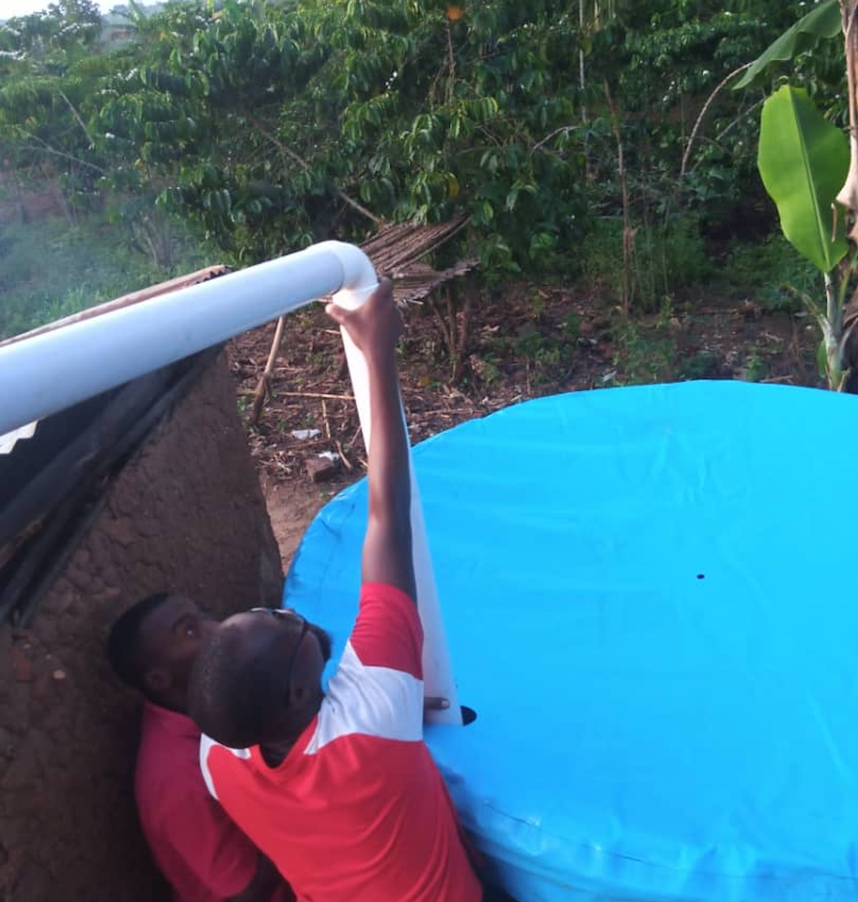

<h2 align="center">Solving procastination and raising awareness for water accessibility one glass at a time!</h2>

## Our Product

FLOCUS is a single-page application that aims to combat procrastination from students working on devices amongst friends while raising awareness for the critical world issue of water accessibility. Our application uses a glass filling up as a visual aid as people work following the principles of the Pomodoro technique of an interval for work followed by a break. In this break, users will have the opportunity to learn more about water accessibility and Asaqua, a charity that is working to improve water accessibility in Africa.

The application will display how much work their friends have done to further encourage good studying practices, thus improving overall productivity and increasing us of our application. 

Our aim is simple: combat procrastination and raise awareness for water accessibility one glass at a time!

### How to use Flcous?

1. Sign in via Facebook plugin.
2. Select how long you'd like to study for and the break time you would like.
3. Start working with the webpage open. Your glass will start to fill.
4. When your glass is full, take a break and learn more about Asaqua, the charity we've partnered with to raise awareness and funds for solving the water accessibility issue in developing nations.
5. See your statistics and compare your work progress compared to your peers.

### Features of Flocus

(TODO SAM)
- 
- 
- 

## Our Target Market

When designing Flocus we had two goals: to help students (like ourselves) reduce procrastination and raise awareness for a critical world issue. Many of the current interval times for students were focused on a clock however after initial focus groups and interviews with friends and family, we identified that an animation would be more suitable and more enticing to use given its novelty compared to a clock timer. Our single-page application provides users with a useful but easy on the eye animation for a study interval while raising awareness and funds for a key issue: water accessibility in developing nations. 

## Who are we passing Flocus onto?

### Asaqua 

Asaqua is dedicated to solving the water crisis in underdeveloped countries by offering an affordable rainwater harvesting solution. We believe our water tanks can facilitate clean water accessibility in rural villages.  Asaqua collaborates with committed locals, NGOs, and research institutes and strives for a sustainable future for our next generation.

Their vision is a world where no child has to trudge miles every day to fetch water, and every individual has the access to clean water.

While, we have been working on this project it was great to learn more about the work Asaqua does in developing nations. This understanding further motivated the team to create a product to the best of our ability given the meaningful impact it could have on both procrastination and helping raise awareness for the work Asaqua does. 

Please see below some very cool photos of the work Asaqua has been doing in Africa:

<b>
A recent photo of the setting up of one of ASAQUA's water accessibility tools!
</b>

We're also very fortunate to have a message from the ASAQUA team on completion of our project:

“We'd like to extend our heartfelt gratitude to Flocus who have been working with us to raise awareness for the water scarcity crisis that 1/3 of the global population are currently facing. The Flocus team shares the same values as us and has provided a fantastic opportunity for ASAQUA to build awareness and potential ad revenues - we are looking forward to taking over the Flocus project in the future. The cooperation between Asaqua and Flocus demonstrates a novel charity model where users can create a social impact digitally.Thank you team Flocus!”

## Team Members

- [**Sam Fitton**](https://github.com/STF1998) (Username: SF17177) 

Sam's role has been focused on full-stack development with a focus on designing the front-end and integrating Facebook's log-in onto the page.

- [**Hugh Hamilton-Green**](https://github.com/hamilh1000) (Username: HH17035)

Hugh's role has been focused on the front-end design and implementation alongside keeping up-to-date with documentation and ensuring the construction of report alongside development.

- [**Jati Wicaksono**](https://github.com/jatiwicaksono98) (Username: CL20627)

Jati's role has been focused on the back-end with particular focus on building our API and integrating with Facebook's API allowing login usability on the page.

- [**Gordon Tse**](https://github.com/gordon-tse) (Username: XV20486)

Gordon's role has been focused on the back-end with particular focus on the database and integration with the Facebook API and data upkeep.

- [**Tom Cockain**](https://github.com/tomcockain) (Username: YW20279)

Tom's role has been focused on integration of front and back-end and aiding Gordon with the database and how we display the selected data on the front-end.

## **Report**

### [1. Introduction](report/introduction.md)
### [2. Background and Motivation](report/backgroundAndMotivation.md)
### [3. System Implementation](report/systemImplementation.md)
### [4. UX Design](report/UXDesign.md)
### [5. Sprints & Project Management](report/sprints&ProjectManagement.md)
### [6. Evaluation](report/evaluation.md)
### [7. Conclusion](report/conclusion.md)
