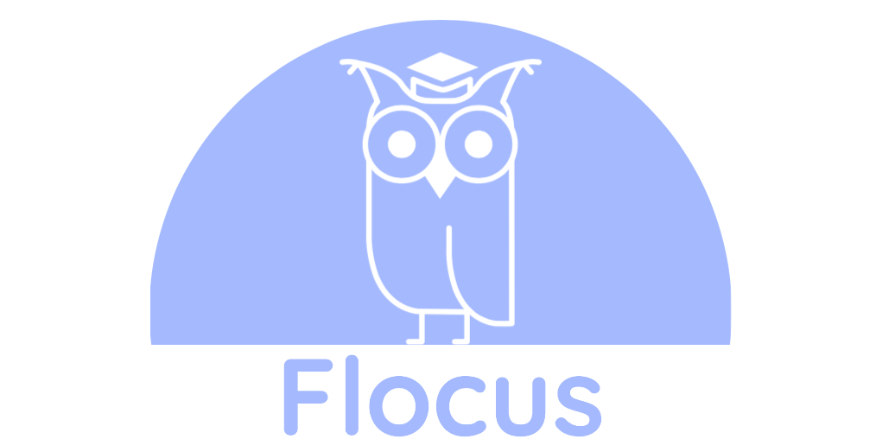

<h2 align="center"><b> A web application designed to sustainably combat procrastination </b> </h2>

## **Team Members**

- Sam

- Hugh

- Jati

- Gordon

- Tom

## **Report**

### [1. Introduction](https:/https://github.com/STF1998/Desk20/report/branch/introduction.md)
### [2. Background and Motivation](https:/https://github.com/STF1998/Desk20/report/branch/backgroundAndMotivation)
### [3. System Implementation](https://github.com/user/repo/blob/branch/systemImplementation)
### [4. UX Design](https:/https://github.com/STF1998/Desk20/report/branch/UXDesign)
### [5. Sprints & Project Management](https:/https://github.com/STF1998/Desk20/report/branch/sprints&ProjectManagement)
### [6. Evaluation](https:/https://github.com/STF1998/Desk20/report/branch/evaluation)
### [7. Conclusion](https:/https://github.com/STF1998/Desk20/report/branch/conclusion)
