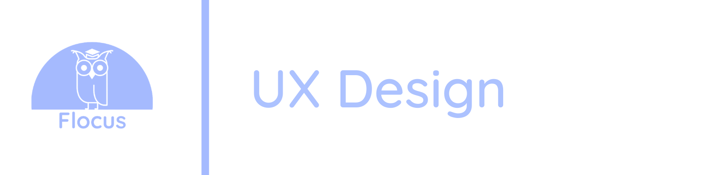
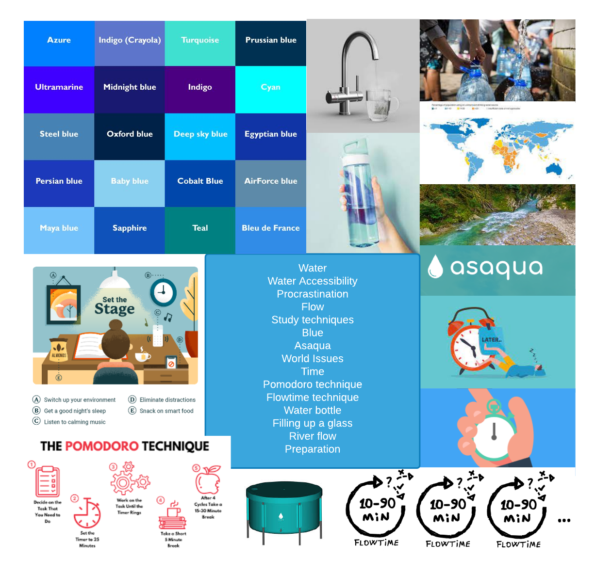

# 5. UX Design [15%]

## Contents of UX Design Section

- [**Design Process**](#Design-Process)
    - [Ideation process](#Ideation-process)
    - [Mood boards](#Mood-boards)
    - [Paper prototyping](#Paper-prototyping)
- [**Users and Stakeholders**](#Users-and-Stakeholders)
    - [Users](#Users)
    - [Stakeholders](#Stakeholders)
- [**UX Approach**](#UX-Approach)
    - [Design heuristics/approach](#Design-heuristics/approach)
    - [Design methods](#Design-methods)
- [**Understanding of User Group**](#Understanding-of-User-Group)
    - [Questionnaires](#Questionnaires)
    - [User Stories](#User-Stories)
    - [Interviews](#Interviews)
- [**Wireframes and Systems**](#Wireframes-and-Systems)

# Design Process

## Ideation process

We formed a matrix as seen below with our top ideas of critical world issues and game ideas. Together we devised our top 5 ideas integrating a game aspect and solving a critical world issue. These included:

- Farm your own forest. The fight against deforestation.	
- Visualisation of how sea levels are rising in certain areas with predictions for next decade.
- Gambling page - that donates to charities
- Interactive timer with competition between friends to help reduce procrastination.
- Shoot all the big tycoons who are dominating fast fashion.

Based upon our own experiences, our teams’ competitive side and Gordon's existing work with an NGO focused on water accessibility, we decided to build a project idea around procrastination, competition with friends and water accessibility. We started developing ideas around how we could reduce procrastination with use of interval times and using inspiration from the Pomodoro technique. Alongside this, our team focused on how we would incorporate the focus on reducing procrastination with the theme of raising awareness for water accessibility. We decided that we wanted to create an interactive animation around water and showing competitive statistics between friends. This led to our punch line of:

Solving procrastination and raising awareness for water accessibility one glass at a time!

## Mood board

Given the situation caused by the COVID=19 pandemic, we decided to create an online mood board using lucid chart allowing us to pull together our ideas around textures, colours, art, photos, typography, patterns and shapes. At this stage, we were starting to narrow down the specifics of our idea while working out what was feasible.

Please see figure below:

<h2 align="center"><b> Figure 1: A mood board created as part of the ideation stage.</b></h2>

## Paper (digital equivalent) prototyping

Based on initial conversations with friends, family and peers, we began drawing up some inital ideas of how we envisaged the application looking and working. We created a user walkthrough of our inital idea and created a Lucidchart to represent what users would see flow through the app with specific attributes asscoiated with different pages/pop-ups.

To see the iteration of the ideation process, see paper prototypes(link to photos of other prototypes). See the figure below representing our paper prototyping with a digital twist:

<h2 align="center"><b> Figure 2: A final paper prototype created as part of the ideation stage.</b></h2>

# Users and Stakeholders

## Users

## Stakeholders

# Understanding of User Group

## User stories

When designing Flocus we had two goals: to help students (like ourselves) reduce procrastination and raise awareness for a critical world issue. Many of the current interval times for students were focused on a clock however after initial focus groups and interviews with friends and family, we identified that an animation would be more suitable and more enticing to use given its novelty compared to a clock timer. Our single-page application provides users with a useful but easy on the eye animation for a study interval while raising awareness and funds for a key issue: water accessibility in developing nations. 

Together we identified that the end-user would need an attractive and simple user-interface to interact with focused around a study interval, statistics and information about the charity and world issue we’re raising awareness for. To begin identifying potential users, our team spent time speaking to family and friends through informal focus groups and interviews to determine whether there is a user group that would use and enjoy the novelty of Flocus. After speaking to family and friends, we started to build specific end-users and created user stories; some examples can be seen below:

-	Gordon is an a-level student who is struggling to concentrate on his exam revision due to distraction from social media and other webpages, such as the news and sport. Gordon wants to use a tool to help him focus for a specific time like 45 minutes. He doesn’t just want to look at a clock so uses Flocus due to its interactive animation of a glass filling up.
-	Hugh is a computer science student who wants to code in short 30 minute sprints however struggles to just go off his phone clock. His lifestyle is driven by sustainability and making ethical decisions as a consumer. Flocus provides him with a good tool to time his specific coding intervals while also knowing he is doing something good for the plant through raising funds and awareness for water accessibility. 
-	Thomas is a university student. He is on the autistic spectrum and struggles with looking at clocks. Flocus provides him with a visual aid instead of a clock timer so he knows how long to work for his study intervals. 

## Questionaires 

Having defined our user stories, we began developing the key aspects around reducing procrastination. Alongside our literature review of papers on procrastination, we developed a survey and sent it out to friends, family and student peers to get information around the perception of procrastination in student populations. This helped determine the core aspects of the application.

From this survey we identified the key points and issues on procrastination in student populations:

- 

You can view our survey here! (TODO add a link to survey)

## Interviews

# Wireframes and Systems

