# 5. UX Design [15%]

## Contents of UX Design Section

- [**Design Process**](#Design-Process)
    - [Ideation process](#Ideation-process)
    - [Mood boards](#Mood-boards)
    - [Paper prototyping](#Paper-prototyping)
- [**Users and Stakeholders**](#Users-and-Stakeholders)
- [**UX Approach**](#UX-Approach)
    - [Design heuristics/approach](#Design-heuristics/approach)
    - [Design methods](#Design-methods)
- [**Understanding of User Group**](#Understanding-of-User-Group)
    - [Questionnaires](#Questionnaires)
    - [User Stories](#User-Stories)
    - [Interviews](#Interviews)
- [**Wireframes and Systems**](#Wireframes-and-Systems)

# Design Process

## Ideation process

We formed a matrix as seen below with our top ideas of critical world issues and game ideas. Together we devised our top 5 ideas integrating a game aspect and solving a critical world issue. These included:

- Farm your own forest. The fight against deforestation.	
- Visualisation of how sea levels are rising in certain areas with predictions for next decade.
- Gambling page - that donates to charities
- Interactive timer with competition between friends to help reduce procrastination.
- Shoot all the big tycoons who are dominating fast fashion.

Based upon our own experiences, our teams’ competitive side and Gordon's existing work with an NGO focused on water accessibility, we decided to build a project idea around procrastination, competition with friends and water accessibility. We started developing ideas around how we could reduce procrastination with use of interval times and using inspiration from the Pomodoro technique. Alongside this, our team focused on how we would incorporate the focus on reducing procrastination with the theme of raising awareness for water accessibility. We decided that we wanted to create an interactive animation around water and showing competitive statistics between friends. This led to our punch line of:

Solving procrastination and raising awareness for water accessibility one glass at a time!

## Mood board

Given the situation caused by the COVID-19 pandemic, we decided to create an online mood board using lucid chart allowing us to pull together our ideas around textures, colours, art, photos, typography, patterns and shapes. At this stage, we were starting to narrow down the specifics of our idea while working out what was feasible.

Please see figure below:

<h2 align="center"><b> Figure 1: A mood board created as part of the ideation stage.</b></h2>

## Paper (digital equivalent) prototyping

Based on initial conversations with friends, family and peers, we began drawing up some inital ideas of how we envisaged the application looking and working. We created a user walkthrough of our inital idea and created a Lucidchart to represent what users would see flow through the app with specific attributes asscoiated with different pages/pop-ups. After creating come lucidcharts, hugh made a short video with a final paper prototype of Flocus.

See the video below representing our paper prototyping with a digital twist:

  

  
   
  <b>Video: Paper Prototype </b>
    

# Users and Stakeholders

After agreeing on the idea of Flocus and deciding on initial design themes and messaging, we needed to ascertain who the stakeholders of the project were and how do we deal with their requirements and concerns. To achieve this, we began by brain-storming main stakeholders and discussing their influence and power over the project. Once we had achieved this, we formulated a Power-Interest matrix to further understand how specific stakeholder groups could have a future impact on the Flocus project. This is displayed below:

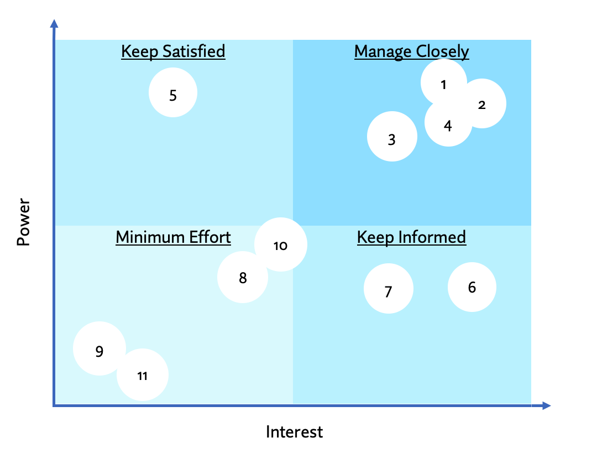

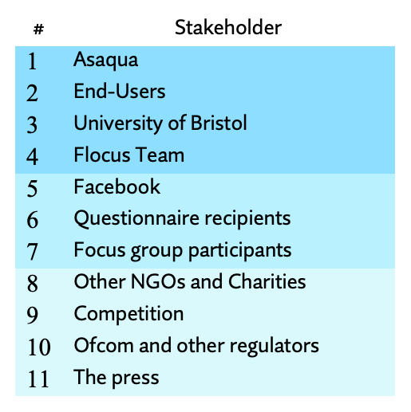

<h2 align="center"><b> Figure : Mendelow's Matrix</b></h2>

We have included some remarks regarding the “Manage Closely”, “Keep Satisfied” and “Keep Informed” stakeholders:

### ASAQUA

Our first stakeholder is Asaqua, the NGO that Flocus is seeking to support. Gordon, a back-end developer and Scrum Master for Flocus, played a key role in liaison between the Asaqua and Flocus teams so to ensure the final project aligned with the NGOs requirements. There were a couple areas in which Asaqua and Flocus identified as potential targets and considerations for the project outcome:
	
- Increase awareness of Asaqua and its operations
- Open a future revenue stream via advertisements and the acquisition of charity donors

### Increase awareness of Asaqua and its operations

In the UK, 9 in 10 households have access to the internet [1] and, on average, adults spend around 5hr 30min online each day [2]. As such, the task to produce a Single Page Application (SPA) offered the perfect opportunity to raise brand awareness for Asaqua. The main tool that Flocus has at its disposal, is the ability to familiarise users with the Asaqua brand. We also wanted to maximise users’ communication with friends which, is part of the reason for why we chose a social media platform for our log-in. Word-of-mouth is one of the most effective ways of building trust and having users connect with their friends and family over Facebook will encourage support and interaction. 

### Future revenue streams

We Identified two main methods in which Flocus could attract funding for Asaqua: ad revenues and user donations. To implement this, we looked at several sites that integrate advertisements and SMS/e-mail sign-ups in a natural way without disrupting overall site functionality. Examples include The Guardian, Facebook, and clothing brands such as ASOS. We also looked at sites such as The Daily Mail which offered a prime example of ad-cluttering which, is certainly something to avoid from a UX standpoint. Despite our previous considerations, we were concerned that the introduction of ads would potentially distract from the design process, resulting in a less user-friendly environment. Additionally, the role of building brand awareness may have been impacted by this funding strategy and as such, we decided not to pursue this. The prospect of introducing donations and subscriptions to Flocus will be pursued by Asaqua if they decide to do so.

### University of Bristol

To succeed on the project, it was a necessity to conform to the specification as set out by the University of Bristol. As such, it was critical to brief external partners such as Asaqua on the scope of the task whilst clarify any queries regarding the project aim. Additionally, as Flocus will be a live project following Asaqua’s takeover and therefore in the public domain, it was crucial that we conducted ourselves in-line with the Universities expectations. 

### Facebook

To implement full functionality, Flocus will need to receive Facebook’s approval for the log-in process. It has therefore been important to conform to Facebook’s best practises guide and expectations whilst in the design process.

# Understanding of User Group

## User stories

When designing Flocus we had two goals: to help students (like ourselves) reduce procrastination and raise awareness for a critical world issue. Many of the current interval times for students were focused on a clock however after initial focus groups and interviews with friends and family, we identified that an animation would be more suitable and more enticing to use given its novelty compared to a clock timer. Our single-page application provides users with a useful but easy on the eye animation for a study interval while raising awareness and funds for a key issue: water accessibility in developing nations. 

Together we identified that the end-user would need an attractive and simple user-interface to interact with focused around a study interval, statistics and information about the charity and world issue we’re raising awareness for. To begin identifying potential users, our team spent time speaking to family and friends through informal focus groups and interviews to determine whether there is a user group that would use and enjoy the novelty of Flocus. After speaking to family and friends, we started to build specific end-users and created user stories; some examples can be seen below:

-	Gordon is an a-level student who is struggling to concentrate on his exam revision due to distraction from social media and other webpages, such as the news and sport. Gordon wants to use a tool to help him focus for a specific time like 45 minutes. He doesn’t just want to look at a clock so uses Flocus due to its interactive animation of a glass filling up.
-	Hugh is a computer science student who wants to code in short 30 minute sprints however struggles to just go off his phone clock. His lifestyle is driven by sustainability and making ethical decisions as a consumer. Flocus provides him with a good tool to time his specific coding intervals while also knowing he is doing something good for the plant through raising funds and awareness for water accessibility. 
-	Thomas is a university student. He is on the autistic spectrum and struggles with looking at clocks. Flocus provides him with a visual aid instead of a clock timer so he knows how long to work for his study intervals. 

## Questionaires 

Having defined our user stories, we began developing the key aspects around reducing procrastination. Alongside our literature review of papers on procrastination, as part of our research into users and the key aspects to focus when trying to reduce procrastination, we created and sent out a google forms survey to university students in our friendship and peer groups. The survey can be seen at this [link](https://forms.gle/rgQhqEh3buj86prAA). Our study did not store any personal or sensitive data/information as well as complying with GDPR regulations with the storage of data agreed at the start of the survey. 

We were able collect data from 23 university students. While the survey was short and with limited responses, it provided a small snapshot of the behaviours, study techniques and interactions with procrastination. Please see below snapshots of the results from the survey:

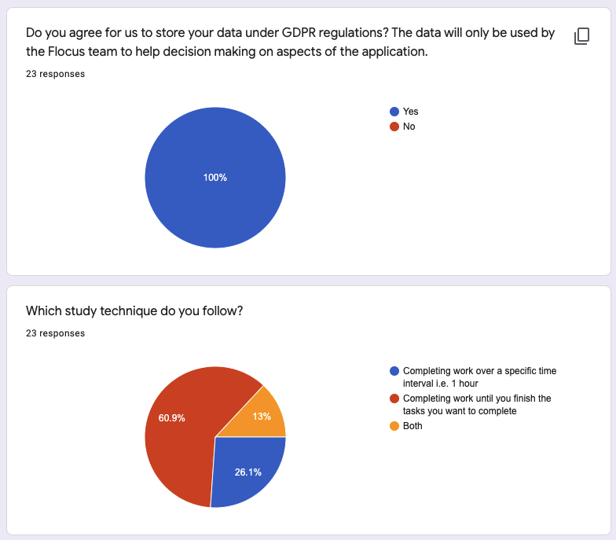

<h2 align="center"><b> Figure : Survey question 1.</b></h2>

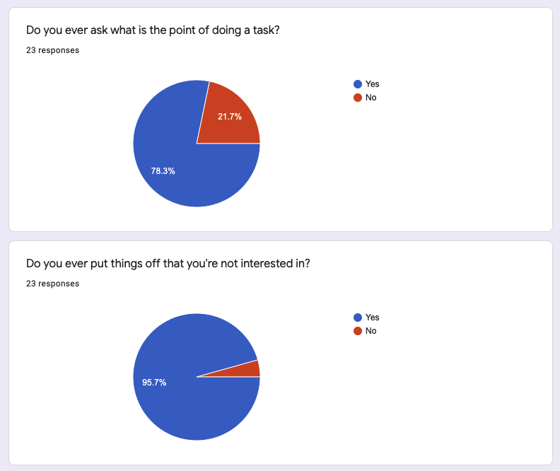

<h2 align="center"><b> Figure : Survey question 2.</b></h2>

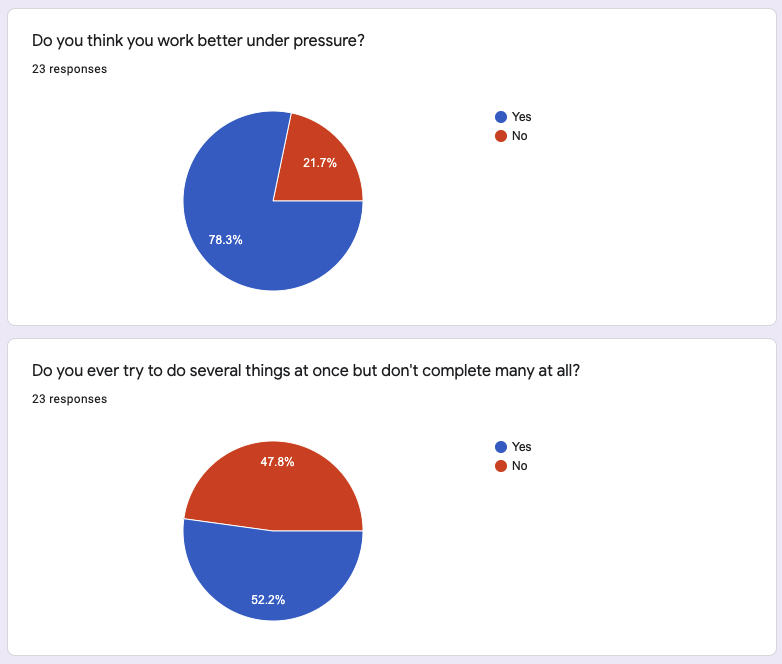

<h2 align="center"><b> Figure : Survey question 3.</b></h2>

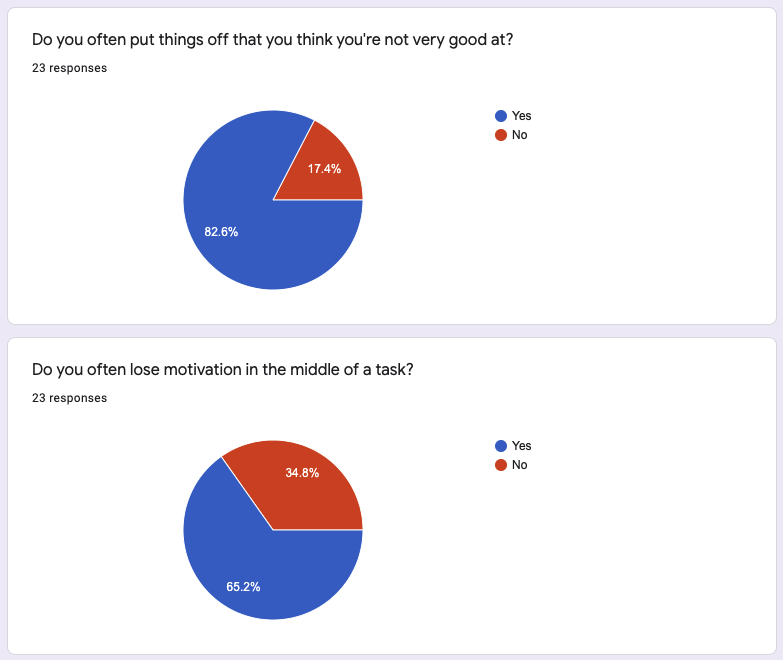

<h2 align="center"><b> Figure : Survey question 4.</b></h2>

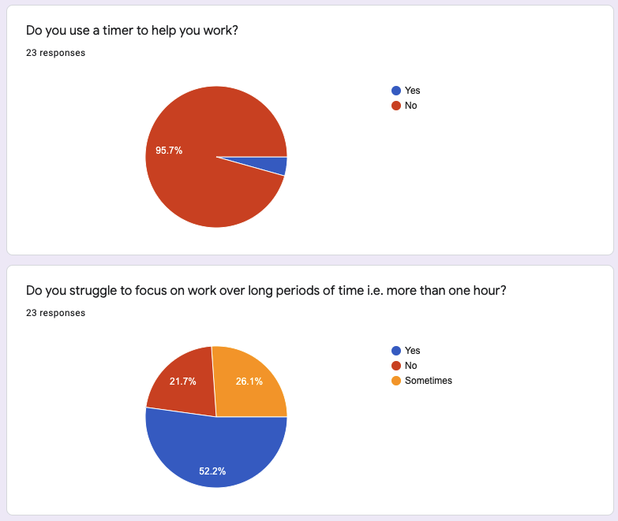

<h2 align="center"><b> Figure : Survey question 5.</b></h2>

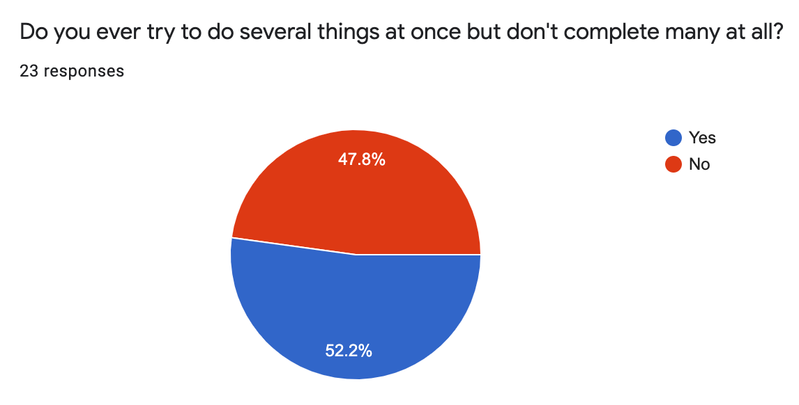

<h2 align="center"><b> Figure : Survey question 6.</b></h2>

<h2 align="center"><b> Figure : Survey question 7.</b></h2>

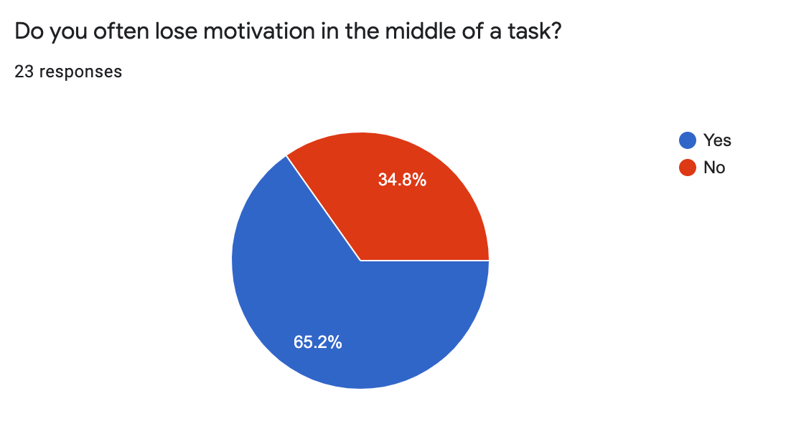

<h2 align="center"><b> Figure : Survey question 8.</b></h2>

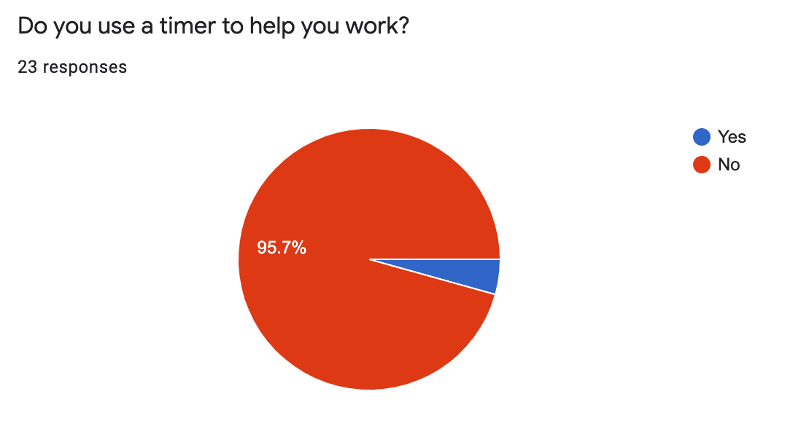

<h2 align="center"><b> Figure : Survey question 9.</b></h2>

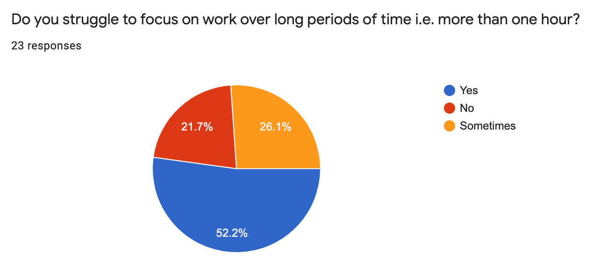

<h2 align="center"><b> Figure : Survey question 10.</b></h2>

From this survey we identified the key points and issues on procrastination in student populations:

- Students struggle with motivation with work they are not interested in (particuarly midway through a task).
- Students work better under pressure - possible use of timer/visual aid.
- Majority of students do not use timers to help them study - large market opportunity to provide students with a useful study tool.

## Interviews and Focus Groups

Due to time restraints and a lack of ethical approval, we decided that interviews would not be suitable for this project. However, if we had the time and ethical approval we would have liked to complete a user interaction focus group and interviews to find out more about study techniques and how users interact with current products/tools that already exist on the market. 

These interviews could be focused on flows on certain webpages with a focus on aesthetics and the front end design of possible competitors. This would help further define the product market fit and opportunity for Flocus.

As an alternative to the above, we held informal conversations with friends and peers to find out more about study techniques and what indidivduals liked about the top 5 current tools on the market (outlined in the [Background and Motivation section](https://github.com/STF1998/Desk20/blob/main/report/backgroundAndMotivation.md)). These conversations, yet infromal, helped build our user personas and stories throughout the design and development process.

# Wireframes and Systems

Having defined our target market and the potential users who would be using Flocus, we quickly developed a strategy around key subsystem requirements and wireframe designs before defining our sprints and product development stage.

## Wireframes

## User flow diagram

Having finalised our SPA and UX design, we put together a simple flow diagram using Lucidchart to display how we envisage users migrating through Flocus. See below:

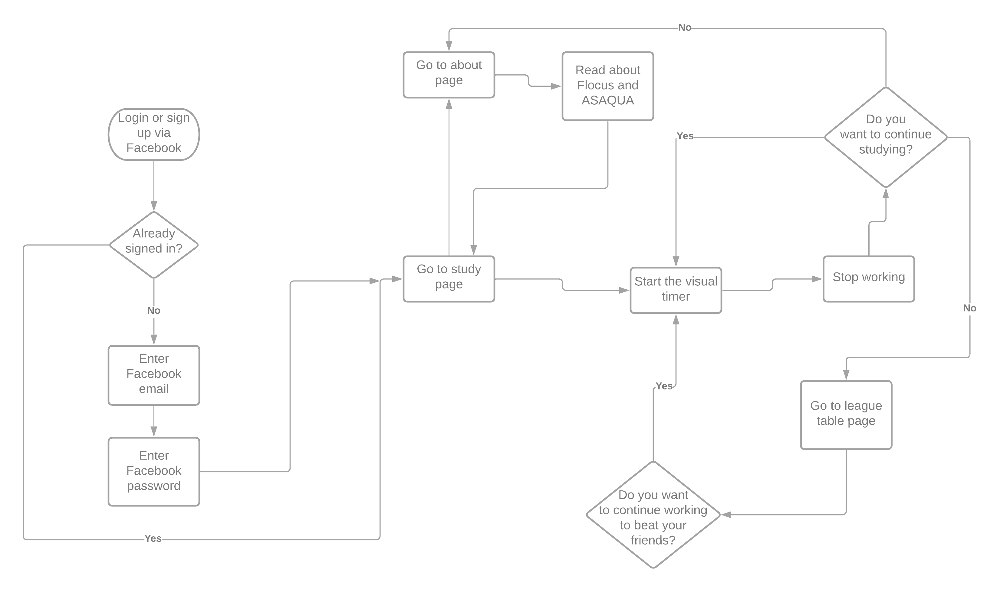

<h2 align="center"><b> Figure : Mendelow's Matrix</b></h2>

# References

[1] https://www.ofcom.org.uk/__data/assets/pdf_file/0024/149253/online-nation-summary.pdf

[2] https://www.digitalinformationworld.com/2019/02/internet-users-spend-more-than-a-quarter-of-their-lives-online.html

# Project report navigation

- [Next page: Sprints and Project Management](https://github.com/STF1998/Desk20/blob/main/report/sprints&ProjectManagement.md)
- [Previous page: System Implementation](https://github.com/STF1998/Desk20/blob/main/report/systemImplementation.md)
- [Go back to Homepage](https://github.com/STF1998/Desk20)
