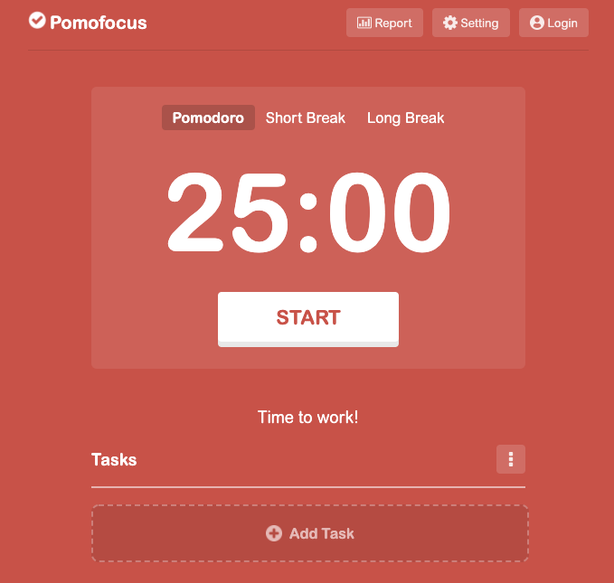
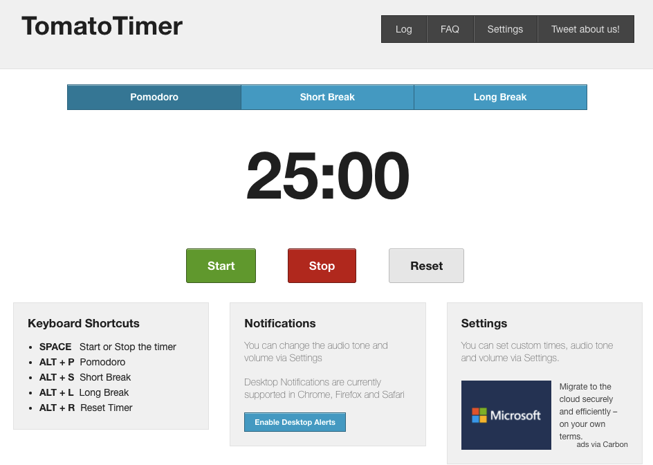
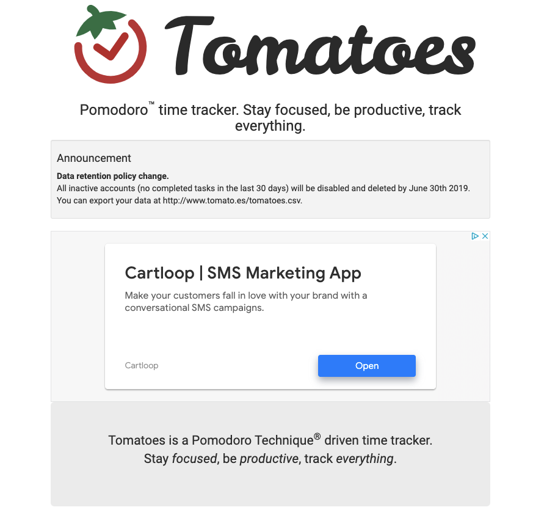
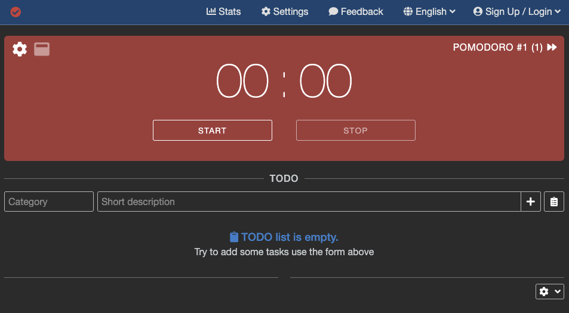
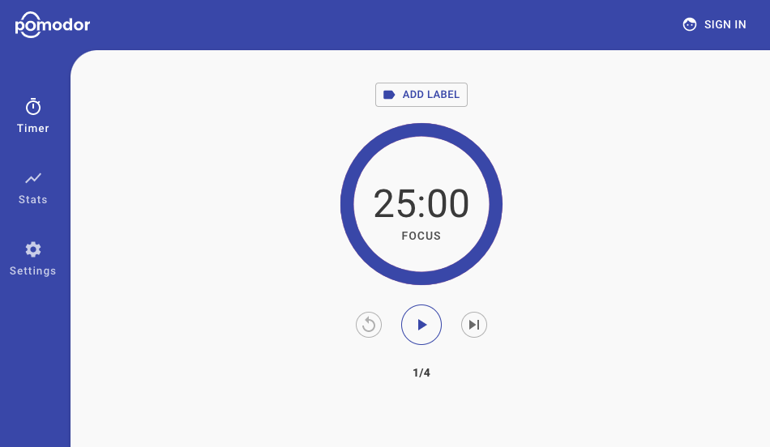

# Background and Motivation [10%]

## Contents of Background and Motivation
- [**Background literature**](#Background-literature)
  - [Overview](#Overview)
  - [Academic research review](#Academic-research-review)
- [**State of the art survey**](#State-of-the-art-survey)
  - [Current industry review](#Current-industry-review)
- [**Defined problem**](#Defined-problem)
  - [Scope](#Scope)
  - [Challenges](#Challenges)

## Background literature

### Overview

When starting this project, our team had little knowledge or understanding of single page applications (SPA’s), Serious Play, and procrastination. During the first month, alongside developing our development skills, we spent time researching and reading papers and articles on the design and technologies to build a successful SPA (Single Page Application) to solve the fundamental problem we had identified: procrastination. This initial research helped further define our project and influenced key aspects around our design and implementation of Flocus. Below we have provided short reviews for the key areas we felt we needed to learn about before starting design and implementation of development. 

### Academic research review

#### Single page applications

Over the past decade, the field of application development has seen significant growth and innovation with the acceleration of development technologies. Single-page applications have become increasingly popular with expanding reach and enhanced user experience [[1](#Reference-List)]. A single-page application is a webpage that updated independently on each user’s action and therefore meaning the application has increased responsiveness and user satisfaction [[2](#Reference-List)]. The architecture of a single page application often consists of the following features [[3](#Reference-List)]:

- Web interface: Interaction between user and web server 

- Individual components: The SPA (Single Page Application) is split into smaller and individual components. 

- Updated/replaced: A component can be updated or replaced by a new component or page.  

- Reloaded: A typical web page needs to be reloaded, opposed to an SPA which will reload automatically.  

- User action: A user can make input to an SPA from any I/O device, causing action to occur. 

#### Serious play

The methodology of Serious Play, an innovative approach to exploring complex issues with the use of playful techniques to engage audiences, was developed by the CEO (Chief Executive Officer) of Lego, Kjeld Kirk Kristiensen, alongside two academic professors at IMD Business School, Bart Victor and Johan Roos. When the above first produced Serious Play, it was intended to be used in corporate sectors generating greater engagement through imaginative and playful approaches to solving business problems [[4](#Reference-List)]. However, since then Serious Play has developed into a core set of activities and processes which integrate both innovative and creative techniques [[5](#Reference-List)]. In recent times, the Serious Play process has been applied to the software development industry with the concept being used as part of design thinking to be more productive and innovative in solving problems [[6](#Reference-List)]. Overall, the Serious Play aspect will be utilised throughout our design and implementation of a single-page web application.

#### Procrastination

Procrastination is a well-known experience amongst academic environments. It is defined as “the needless delay of things one intends to do” often associated with negative outcomes about performance and subjective wellbeing [[7](#Reference-List)]. Studies, such as those undertaken by Klingsieck et al. [[8](#Reference-List)], suggest that over 70% of college students tend to procrastinate on a regular basis, often with negative consequences. Kim and Seo [[9](#Reference-List)] found that younger students often procrastinate more than older students with a possible applanation of the maturity level and inability to take responsibility for their own learning. 

There is a growing body of research that explains the phenomenon of procrastination as a self-regulation challenge [[10](#Reference-List)]. Ferrari [[11](#Reference-List)] suggests that students need support or tools to help self-regulate their behaviours when in a learning environment. Zimmerman [[12](#Reference-List)] suggests that students need to learn how to effectively use tools and strategies to help improve self-regulation. In recent times, little research has focused on tools and interventions for procrastination. Overall, our idea to create a procrastination tool fills a clear gap in providing a solution to help students self-regulate their learning and study techniques. 

#### Pomodoro Technique

Having researched procrastination tools, our team identified the Pomodoro technique as a key tool to inspire our single page application around increasing productivity and reducing procrastination. The Pomodoro technique was developed by Francesco Cirillo. When he came across the technique, Francesco was struggling to focus on his university work leading to him to commit to studying for 10 minutes. He found a tomato shaped timer and the now Pomodoro technique was created. Its biggest benefit is its simplicity with the following easy and simple steps:

1.	Get a to-do list and a timer.
2.	Set your timer for 25 minutes and focus on a single task until the timer rings.
3.	When your session ends, mark off one pomodoro and record what you completed.
4.	Then enjoy a five-minute break.
5.	After four Pomodoro’s, take a longer, more restorative 15 to 30 minute break.

Learn more about the Pomodoro technique at this [link](https://francescocirillo.com/pages/pomodoro-technique)!

Having singled out the Pomodoro technique as a key tool to combat procrastination, we quickly identified existing applications that are based on the technique. These web applications can be seen below in the following section.

## State of the art survey

Having identified the procrastination tools as the area of focus, the team then started to research and identify the top 5 current products/tools to help reduce procrastination using the pomodoro technique. While all had similar aspects and technologies, each had subtle differences which can be seen the current industry review below. 

### Current industry review

Having agreed that we would like to build a single page application inspired by the Pomodoro technique, we set about researching and analysing current existing web applications on the market that utilise the Pomodoro technique to help reduce procrastination and improve student productivity. 

#### Pomofocus 

Website: https://pomofocus.io/

Pomofocus is an online pomodoro timer that works on both web and mobile browsers. The webpage revolves around a large timer with different colour backgrounds for study and break intervals (red for study, blue for break).

<b>
 Figure 1: Screenshot of Pomofocus website 
</b>

<table>
<tr>
  <th>Pros</th>
  <th>Cons</th>
</tr>
<tr>
  <td>
    <ul>
      <li> Simple and clear front end. Minimal but sleek UX design. </li>
      <li> Simplified and fast web application. </li>
      <li> No advertising. </li>
      <li> Visits are up 32% to 4.75 million total visits in 2020. </li>
      <li> Ability to set a certain number of tasks. </li>
    </ul>
  </td>
  <td>
    <ul>
      <li> Cannot compete with friends on time studied/focused. </li>
      <li> No social cause aspect. </li>
      <li> Nothing to do or read about in the break interval. </li>
    </ul>
  </td>
</table>

#### Tomato Timer

Website: https://tomato-timer.com/

Tomato timer is an online clock timer that follows the Pomodoro technique inspired by Tomatoi.st. It uses jQuery and HTML5 features like Desktop Notifications, Audio API and Local Storage instead of relying on Adobe Flash and other such technologies.

<b>
 Figure 2: Screenshot of Tomato Timer website 
</b>

<table>
<tr>
  <th>Pros</th>
  <th>Cons</th>
</tr>
<tr>
  <td>
    <ul>
      <li> Simple and to the point. </li>
      <li> Ability to set notifications so you don’t have to stay on the page. </li>
      <li> Keyboard shortcuts. </li>
      <li> Ability to change the alert sound. </li>
      <li> No advertising on the website. </li>
      <li> Ability to set custom goals. </li>
      <li> No sign-up requirement. </li>
    </ul>
  </td>
  <td>
    <ul>
      <li> No insight into what you’re doing with that time. </li>
      <li> Unattractive front end design. </li>
      <li> No ability to track past activity. </li>
    </ul>
  </td>
</table>

#### Tomatoes

Website: http://www.tomato.es/

Tomatoes is a Pomodoro Technique driven time tracker.

<b>
 Figure 3: Screenshot of Tomatoes website 
</b>

<table>
<tr>
  <th>Pros</th>
  <th>Cons</th>
</tr>
<tr>
  <td>
    <ul>
      <li> Simple and minimalist design. </li>
      <li> Ability to track history of work by signing in via GitHub or Twitter. </li>
    </ul>
  </td>
  <td>
    <ul>
      <li> Advertising at different areas on the page. This is quite distracting. </li>
      <li> Fixed timer at 25 minutes. </li>
      <li> Not simple to navigate. </li>
    </ul>
  </td>
</table>

#### Pomodoro Tracker

Website: https://www.pomodoro-tracker.com/

Pomodoro Tracker is a simple and free time tracker inspired by the Pomodoro technique. 

<b>
 Figure 4: Screenshot of Pomodoro Tracker website 
</b>

<table>
<tr>
  <th>Pros</th>
  <th>Cons</th>
</tr>
<tr>
  <td>
    <ul>
      <li> No login required. </li>
      <li> Ability to set a to-do list and track individual tasks by category. </li>
      <li> Provides a set of tips and ideas to help productivity. </li>
      <li> Can be in multiple languages.  </li>
      <li> Shows statistics of work if signed in. </li>
    </ul>
  </td>
  <td>
    <ul>
      <li> Advertising on the page. </li>
      <li> The colour of the text isn’t particular clear due to light grey text on charcoal grey background. </li>
    </ul>
  </td>
</table>

#### Pomodor

Website: https://pomodor.app/timer

Easy-to-use web-based Pomodoro timer.

<b>
 Figure 5: Screenshot of Pomodor website 
</b>

<table>
<tr>
  <th>Pros</th>
  <th>Cons</th>
</tr>
<tr>
  <td>
    <ul>
      <li> Incredibly simple. </li>
      <li> Ability to add labels to your timers and set tasks. </li>
      <li> Provides a set of tips and ideas to help productivity. </li>
      <li> Provides useful statistics as an insight into your study behaviours.  </li>
      <li> Easy adjustment of settings. </li>
    </ul>
  </td>
  <td>
    <ul>
      <li> Very basic user interface. </li>
      <li> No animations. </li>
      <li> Clock timer doesn't fit the page. </li>
      <li> Better suited to mobile device browsers. </li>
    </ul>
  </td>
</table>

#### Market Opportunities identified from current industry research

Based on current market research, we identified the following market gaps and places for improvement for online procrastination tools inspired by the Pomodoro technique: 

- Lack of visual aid - sole focus on a clock timer. 

- Very few had the ability to see statistics compared to friend's work/study behaviours. 

- None had a social enterprise aspect or links with a charity or charitable organisation. 

- Lack of animations and visual aids. 

## Defined problem

The problem we aim to solve is procrastination in university student populations and a lack of awareness for water scarcity in underdeveloped nations across Africa.

### Scope

#### Conceptual scope

With the use of a visual aid of a glass filling up, our aim is to create a SPA (single page application) that helps reduce procrastination and provides an insight into the critical issue of water scarcity in underdeveloped nations through the work of Asaqua. We have focused on providing a simple but effective solution to reducing procrastination with a visual aid as a timer and install a competitive aspect using league tables with friends. We have the theme of water running through our application with the link to water scarcity and the work Asaqua does to help improve this in underdeveloped nations. 

Our application is a useful tool that not only provides a solution to help reduce procrastination and increase work productivity but provides an insight into the work Asaqua does to help improve water scarcity. Thus, our application looks to raise awareness for water accessibility while also provoking changes in studying behaviours in university student populations.  

- For procrastination, we are aiming to provoke a change in behaviour by using a visual aid to help students/employees ensure they are focused on their work and not being distracted by other factors.  

- For Asaqua, we are looking to raise awareness for a critical issue around water scarcity in underdeveloped nations. 
 
Our initial demographic group is students aged 16-24 including school and university students. We realise there is scope to extend this out to employees to help those working from home and tracking their work concentration however given the short timeline of this project we have decided to focus on the demographic we understand the best given we are students ourselves. 

#### Technical scope

Prior to the start of the development sprints, we had gained a broad understanding of the challenges that lay ahead and were therefore able to allocate project roles. We opted for a 3:2 split with three members (Jati, Gordon and Tom) responsible for back-end and two members (Sam and Hugh) responsible for the Front-end. The primary reason for this split was the ambition to use the external Facebook API in our project implementation. We expected there to be big challenges with the set-up of our database and APIs, having three individuals working on these tasks greatly helped the process. Additionally, having two group members on the front-end enabled us to perfect the user experience and focus on our user group feedback. 

When we embarked on this challenge, most of us were novices when it came to web-development. Both Hugh and Gordon had previous experience in creating websites for their businesses and charities (H2Nutrition and Asaqua, respectively) but little experience with projects of this scope. As with most projects, the ideation process often provided exciting concepts that were far beyond our reach. Hugh and Gordon, with their prior experience, offered good guidance to mitigate an over-ambitious scope. We believe that we selected an ambitious MVP to implement but, given the level of support offered by TAs, course peers and online forums, we were confident that the project was achievable.

One of the primary aims, procrastination reduction, is a goal that is very difficult to achieve. Social media, persuasive advertisements, and other interesting digital distractions are working against us in trying to reach this outcome. To be able to convince the final markers, end-users, and focus group participants of our concept, we had to produce an environment that was enjoyable, distraction-free and offered genuine benefits for reducing procrastination. For this, front end-development was crucial. We also wanted to be able to display Flocus’s power to encourage interaction and competition and as such, the back-end also had to be highly functional. To achieve the desired level of functionality, we had to implement a live dataset that is easily accessible by users.

However, there were areas of the technical scope that we had to trim to complete our MVP:

-	Being able to view oneself in the league – this was a significant hurdle in the project and was particularly down to the arrangement of the API and database. As such, we decided to offer a league table that did not include the user. However, the user is still able to compare via the personal stats section. 
-	Portal Customisation
-	Advertisements

#### Technical user-story

Say an individual, that goes by the name of John Doe, is plagued by procrastination in his study sessions. A facebook friend, who is also a fellow procrastinater, informs John Doe of a superb application that has cut his procrastination in half ... it's called flocus. John, being curious, decides to join up with the Flocus application. When he logs in and checks out the league table, he realises that most of his friends on Facebook are also using Flocus and their studying times this week have been a lot more than he would have expected. John, being a competitive person, sees that his friends and family are working hard in their studies and, as a result, becomes motivated to show his peers how much of a hard worker he can be. This was only possible because of the fantastic front end development and implementation of a league table + personal stats section within the application. However, there were some areas that John Doe was frustrated with:

- He couldnt see himself in the league table
- He couldnt customise his site or produce a unique icon for himself
- He wanted to know more about his personal working habits

### Challenges

Given limited resources and time restraints, the biggest challenge of this project is effectively creating an MVP (minimum viable product) that is a tool to help reduce procrastination but also raises awareness for a critical issue in water scarcity and the work Asaqua does to improve water accessibility in underdeveloped countries. 

For the front-end, the biggest challenge will be building and integrating slick animations to portray the theme of water but also a visual aid as a timer.  

For the backend, the biggest challenge will be integrating with Facebook-API and selecting the data to be outputted on the webpage as part of the league table. 

## Reference List

[1] R. J. Joseph, Single page application and canvas drawing, International Journal of Web & Semantic Technology. 6 (2015) 29.

[2] A. V. D. Ali Mesbah, An Architectural Style for Ajax. Proceedings of the 6th Working
IEEE/IFIP Conference on Software Architecture (WICSA'07). IEEE Computer Society, 2007.

[3] E. Molin. Comparison of Single-Page Application Frameworks. KTH ROYAL INSTITUTE OF TECHNOLOGY
SCHOOL OF COMPUTER SCIENCE AND COMMUNICATION, 2016.

[4] S. Nolan. ‘Physical Metaphorical Modelling with Lego as a Technology for
Collaborative Personalised Learning’, in O’Donohue, J. (ed.) Technology-supported
environments for personalized learning: methods and case studies. USA:
Information Science Reference, pp. 364-385. 2009.

[5] J. P. Gee. What Video Games Have to Teach Us About Learning and Literacy.
New York: Palgrave Macmillan, 2004.

[6] J. Flach. Serious Play: A different slant on Design Thinking. 2018.

[7] K. B. Klingsieck. Procrastination: When good things don’t come to those who wait.
European Psychologist, 18(1), 24–34, 2013. doi:10.1027/1016-9040/a000138

[8] Klingsieck, K. B., Grund, A., Schmid, S., & Fries, S. Why students procrastinate: A
qualitative approach. Journal of College Student Development, 54(4), 397–412, 2013. doi:10.1353/
csd.2013.0060

[9] K. R. Kim & E. H. Seo. The relationship between procrastination and academic performance: A meta-analysis. Personality and Individual Differences, 82, 26–33, 2015. https://doi.org/10.1016/j.paid.2015.02.038

[10] T. A. Pychyl & G. L. Flett. Procrastination and self-regulatory failure: An introduction
to the special issue. Journal of Rational-Emotive & Cognitive-Behavior Therapy, 30(4), 203–212, 2012. doi:10.1007/s10942-012-0149-5

[11] J. R. Ferrari. Procrastination as self-regulation failure of performance: Effects of
cognitive load, self-awareness, and time limits on ‘working best under pressure’. European
Journal of Personality, 15(5), 391–406, 2001. doi:10.1002/per.413.abs

[12] B. J. Zimmerman. Investigating self-regulation and motivation: Historical background, methodological developments, and future prospects. American Educational Research Journal, 45(1), 166–183, 2008. doi:10.3102/0002831207312909

## Project report navigation

- [Next page: System Implementation](https://github.com/STF1998/Desk20/blob/main/report/systemImplementation.md)
- [Previous page: Introduction](https://github.com/STF1998/Desk20/blob/main/report/introduction.md)
- [Go back to Homepage](https://github.com/STF1998/Desk20)
