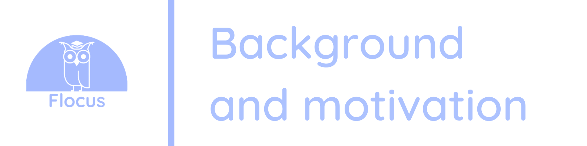

# 1. Background and Motivation [10%]

## Contents of Background and Motivation
- [**Background literature**](#Background-literature)
  - [Overview](#Overview)
  - [Academic research review](#Academic-research-review)
- [**State of the art survey**](#State-of-the-art-survey)
- [**Current industry review**](#Current-industry-review)
- [**Defined problem**](#Defined-problem)
  - [Scope](#Scope)
  - [Challenges](#Challenges)

# Background literature

## Overview

When starting this project, our team had little knowledge of the research on single-page applications, Serious Play and procrastination. During the initial month, alongside developing our development skills we spent time researching and reading on the technology we were implementing to solve the serious problem we identified: procrastination. This initial research helped further define our project and influenced key aspects around our design and implementation. Below we have provided short reviews for the key areas we felt we needed to learn about before starting design and implementation of development.

## Academic research review

### Single page applications

Over the past decade, the field of application development has seen significant growth and innovation with the acceleration of development technologies. Single-page applications have become increasingly popular with expanding reach and enhanced user experience (Joseph, 2015). A single-page application is a webpage that updated independently on each user’s action and therefore meaning the application has increased responsiveness and user satisfaction (Mesbah, 2006). The architecture of a single page application often consists of the following features (Molin, 2016):
-	Web interface: Interaction between user and web server
-	Individual components: The SPA is split into smaller and individual components.
-	Updated/replaced: A component can be updated or replaced by a new component or page. 
-	Reloaded: A typical web page needs to be reloaded, in contrary to an SPA. 
-	User action: A user can make input to an SPA from any I/O device, causing action to occur.

### Serious play

The methodology of Serious Play, an innovative approach to exploring complex issues with the use of playful techniques to engage audiences, was developed by the CEO of Lego, Kjeld Kirk Kristiensen, alongside two academic professors at IMD Business School, Bart Victor and Johan Roos. When the above first came up with Serious Play it was intended to be used in corporate sectors generating greater engagement through imaginative and playful approaches to solving business problems (Nolan, 2009). However, since then Serious Play has developed into a core set of activities and processes which integrate both innovative and creative techniques (Gee, 2004). In recent times, the Serious Play process has been applied to the software development industry with the concept being used as part of design thinking to be more productive and innovative in solving problems (Flach, 2018). Overall, the Serious Play aspect will be utilised throughout our design and implementation of a single-page web application.

### Procrastination

Procrastination is a well-known experience amongst academic environments. It is defined as “the needless delay of things one intends to do” often associated with negative outcomes with regard to performance and subjective wellbeing (Klingseick, 2013). Studies, such as those undertaken by Klingsieck et al. (2013), suggest that over 70% of college students tend to procrastinate on a regular basis, often with negative consequences. Kim and Seo (2015) found that younger students often procrastinate more than older students with a possible applanation of the maturity level and inability to take responsibility for their own learning. 

There is a growing body of research that explains the phenomenon of procrastination as a self-regulation challenge (Pychyl & Flett, 2012). Ferrari (2001) suggests that students need support or tools to help self-regulate their behaviours when in a learning environment. Zimmerman (2008) suggests that students need to learn how to effectively use tools and strategies to help improve self-regulation. In recent times, little research has focused on tools and interventions for procrastination. Overall, our idea to create a procrastination tool fills a clear gap in providing a solution to help students self-regulate their learning and study techniques. 

### Pomodoro Technique

Having researched procrastination tools, our team identified the Pomodoro Technique as a key tool to inspire our single page application around increasing productivity and reducing procrastination. The pomodoro technique was developed by Francesco Cirillo. When he came across the technique, Francesco was struggling to focus on his university work leading to him committing to studying for 10 minutes. He found a tomato shaped timer and the now Pomodoro Technique was created. Its biggest benefit is its simplicity with the following easy and simple steps:

1.	Get a to-do list and a timer.
2.	Set your timer for 25 minutes and focus on a single task until the timer rings.
3.	When your session ends, mark off one pomodoro and record what you completed.
4.	Then enjoy a five-minute break.
5.	After four Pomodoro’s, take a longer, more restorative 15-30 minute break.

Learn more about the Pomodoro technique at this [link](https://francescocirillo.com/pages/pomodoro-technique)!

Having identified the Pomodoro Technique as a key tool to combat procrastination, we quickly identified existing applications that are based on the technique. This can be seen below in the current industry review.

# State of the art survey

# Current industry review

Having agreed that we would like to build a single page application inspired by the pomodoro technique, we set about researching and analysing current webpages out there that utilise the Pomodoro technique to help reduce procrastination and improve student productivity. We came up with a list 

## Pomofocus 

Website: https://pomofocus.io/

Website summary:

Pomofocus is an online pomodoro timer that works on both web and mobile browsers. The webpage revolves around a large timer with different colour backgrounds for study and break intervals (red for study, blue for break).

<table>
<tr>
  <th>Pros</th>
  <th>Cons</th>
</tr>
<tr>
  <td>
    <ul>
      <li> Simple and clear front-end. Minimal but sleek UX design. </li>
      <li> Simplified and fast web application. </li>
      <li> No advertising. </li>
      <li> Visits are up 32% to 4.75million total visits. </li>
    </ul>
  </td>
  <td>
    <ul>
      <li> Can’t compete with friends on time studied/focused. </li>
      <li> No social cause aspect. </li>
      <li> Nothing to do or read about in the break interval. </li>
    </ul>
  </td>
</table>

# Defined problem

## Scope
## Challenges

## Reference List

Ali Mesbah, A. V. D. 2006. An Architectural Style for Ajax. Proceedings of the 6th Working
IEEE/IFIP Conference on Software Architecture (WICSA'07). IEEE Computer Society, 2007.

Ferrari, J. R. 2001. Procrastination as self-regulation failure of performance: Effects of
cognitive load, self-awareness, and time limits on ‘working best under pressure’. European
Journal of Personality, 15(5), 391–406. doi:10.1002/per.413.abs

Flach, J. 2018. Serious Play: A different slant on Design Thinking. 

Gee, J, P. 2004. What Video Games Have to Teach Us About Learning and Literacy.
New York: Palgrave Macmillan.

Klingsieck, K. B. (2013). Procrastination: When good things don’t come to those who wait.
European Psychologist, 18(1), 24–34. doi:10.1027/1016-9040/a000138

Klingsieck, K. B., Grund, A., Schmid, S., & Fries, S. (2013). Why students procrastinate: A
qualitative approach. Journal of College Student Development, 54(4), 397–412. doi:10.1353/
csd.2013.0060

Nolan, S. 2009. ‘Physical Metaphorical Modelling with Lego as a Technology for
Collaborative Personalised Learning’, in O’Donohue, J. (ed.) Technology-supported
environments for personalized learning: methods and case studies. USA:
Information Science Reference, pp. 364-385.

Pychyl, T. A., & Flett, G. L. 2012. Procrastination and self-regulatory failure: An introduction
to the special issue. Journal of Rational-Emotive & Cognitive-Behavior Therapy, 30(4), 203–212. doi:10.1007/s10942-012-0149-5

Zimmerman, B. J. (2008). Investigating self-regulation and motivation: Historical background, methodological developments, and future prospects. American Educational Research Journal, 45(1), 166–183. doi:10.3102/0002831207312909
