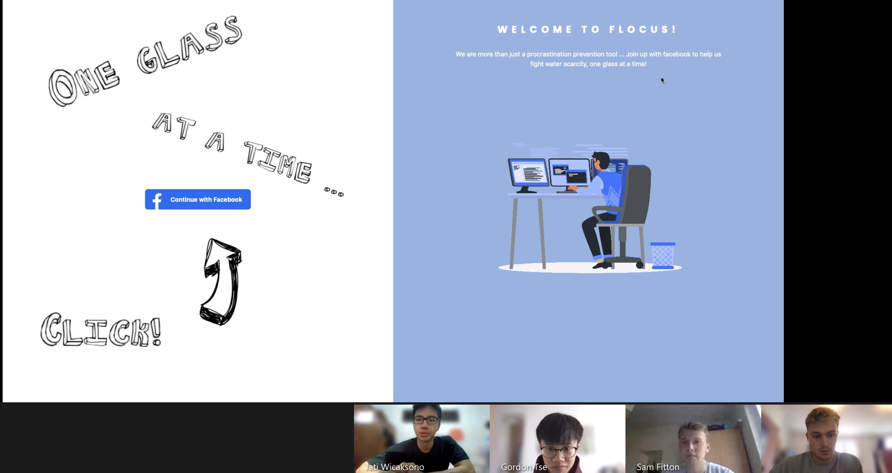

# Conclusion [10%]

## Contents of Conclusion

- [**Working practices**](#Working-practices)
  - [General working practices](#General-working-practices)
  - [Management of isses](#Management-of-issues)
  - [Evaluation of agile techniques](#Evaluation-of-agile-techniques)
- [**Project reflection**](#Project-reflection)
- [**Impact of COVID-19 on working practices**](#Impact-of-COVID-19-on-working-practices)
- [**Discussion of Social and Ethical implications of our work**](#Discussion-of-Social-and-Ethical-implications-of-our-work)
  - [User Data Privacy](#User-Data-Privacy)
  - [Stress, Anxiety and Overworking](#Stress,-Anxiety-and-Overworking)
  - [Focus Group](#Focus-Group)
- [**Discussion of future work**](#Discussion-of-future-work)
  - [Design and development](#Design-and-development)
  - [Development testing](#Development-testing)
  - [Evaluation](#Evaluation)
- [**Summary**](#Summary)

## Working practices

### General working practices

Throughout the project, we feel we have worked effectively and efficiently with one another with consistent communication throughout the design, development, and evaluation process.

From the beginning, everyone in the team expressed a desire to work in specific areas, one of the reasons we believe we worked well together as a group. Sam took more of a leadership role alongside front-end development with effective management across full-stack development. While initially we were slightly disjointed in the design stage of the project, we came together very well prior to the Easter break to define our project and vision together for this project. This ensured we were aligned as we approached the development stage.

While we may have struggled at times to get everyone in a meeting due to covid restrictions and difference in time zones, we feel our use of alternative technology, creation of discord chats and, use of GitHub allowed the group to work effectively regardless of location or time zone. In the key sprints of development, our team had regular weekly meetings at the start of the week to ensure everyone’s progress and aims for the week were on the same page. If we had any issues throughout the week, we effectively shared queries via the discord chat and Sam hosted regular 1-to-1 talks with team members to ensure they were on track. 

### Management of issues

Initially, as a team we did struggle with team communication. This was caused by the lack of familiarity with one another and challenging coursework in other modules. However, to improve our relationship as a team we started to meet more regularly, having short meetings before the Thursday lab where we would update one another on ideas, progress on the project and day-to-day activities. 

At the start, we found this incredibly useful to get to know one another given the current virtual environment we found ourselves in. As we approached the development sprints, these meetings became incredibly useful in helping define our project as well as ensuring each member understood all the aspects of Flocus. As we approached sprint development before the Easter break, we started dividing into subgroups with Sam and Hugh focused on the front-end and Jati, Gordon and Tom focused on the back-end. Alongside our weekly meetings on Thursday, these subgroups would meet at the beginning of each week to go over any issues and talk about the work for the upcoming week. 

This worked well, particularly in the development sprints, allowing subgroups to focus on specific problems and challenges with the Thursday meetings used to ensure everyone was on the same page and discuss prioritised issues. We often built the project in Docker on the Thursday meetings to ensure everything was running as it should with a focus on checking the implementations from the previous week of development. 

Please see an example below of the Flocus team using a Thursday meeting opportunity to discuss the Facebook login page. 

 

<b>
 Figure 1: A screenshot of a recent team meeting discussing the Facebook login page. 
</b>
 

Alongside these meetings, the use of discord was key for the management of issues. As seen in the communication channels section, we had different discord sub-channels to discuss specific issues. These were incredibly useful for sub-teams to query issues and if a specific challenge required the whole team, discussion took place in the general channel. Overall, the regular team and sub-team meetings alongside use of discord channels enabled quick resolution of any of the issues that the team came across throughout the project.

### Evaluation of agile techniques 

During our final stand-up &#128543;, we discussed our overall experience of the project, including our personal experiences of the agile framework. We identified four main aspects of agile that enabled us to succeed in our ambitions:

<ul>
  <li>Stakeholder Involvement</li>
  <li>Customer Collaboration</li>
  <li>Flexibility</li>
  <li>Stress-reduction</li>
</ul>

Our sprints enabled us to focus on an iterative process of development and allowed us to engage key stakeholders towards the end of each sprint – facilitating a customer centric approach. Additionally, we were able to integrate ASAQUA, our partner NGO, into the development process through Gordon’s end-of-sprint liaison and feedback sessions with their team. Organising our tasks into manageable responsibilities also helped the team deal with stress, ensuring that no-one was overwhelmed with work. 

The flexibility of agile added significant value to our MVP. Instead of being focused on process and pre-composed plans, being able to deal with our individual and group responsibilities during incremental sprints, facilitated a greater responsiveness to end-user and stakeholder feedback. This ensured that our design did not deviate from our initial objectives for the theme and message of the application. Additionally, from the feedback that Gordon received from the ASAQUA team, the transparency provided by the Agile framework allowed them to maintain a full understating of development. This will provide benefit in the future as ASAQUA builds on the work that we have previously achieved.  

Agile has been a powerful tool, not only affording benefits to the development team, but also assuring client and stakeholder engagement. Furthermore, agile has helped us deal with issues in an easy and concise manner (such as scheduling and scope creep). As a team, we are incredibly happy that we have maintained this approach throughout the project.

 

## Project reflection

Overall, we are immensely proud of Flocus, including the design, development, and evaluation of our MVP (minimum viable product). 

At the start, we believe we got slightly ahead of ourselves by trying to plan a project idea that had far too many moving parts for a project of this size. However, after a couple of meetings we quickly nailed down the area of focus to procrastination with an aspect of raising awareness for a critical world issue. While the project required only one of these aspects, we believed we could effectively and efficiently design a product that was a procrastination tool but raised awareness for water accessibility, including the theme of water running throughout the whole application. 

Due to our extensive ideas and aspirations as a team, when we approached discussing the success of our product, we slightly struggled to define whether our project was a success. On one side we had created a minimum viable product that functioned effectively with a Facebook Login capability. However, on the other side there were still areas, such as the google ads and portal personlisation, that we still wanted to integrate into the application. Overall, we had been successful in creating an MVP with future potential to help raise funds for ASAQUA and, an application that acts as a highly effective procrastination tool. 

So, while we had not met our personal goals for the product, we had been successful in developing an MVP to be passed onto the development team at ASQUA to further optimise and improve the web application soon.  

 

## Impact of COVID-19 on working practices

Overall, we believe we successfully adapted and changed our approach to ensure we delivered a strong MVP (minimum viable product) given circumstances created by the COVID-19 pandemic. Initially, the biggest challenge was developing relationships between team members. However, as mentioned above, the more meeting and catch ups we had, the more we got to know one another. This meant that by the time we came to designing Flocus, the team had gelled well and were on the same page regarding the project. 

At times it could have been useful to be in the same room as one another. However, with effective use of teams and discord we were able to quickly come together (albeit virtually) to overcome any challenges we had. We believe one key aspect that ensured we worked successfully as a team was the ability to hold one another accountable for individual work. Without building those initial relationships, this would have been extremely hard. Credit must be given to team member, Jati, who due to the time zone difference was working late into the night in numerous occasions. Our use of virtual tools, as mentioned, ensured we kept an effective communication channel with Jati throughout the project. 

Overall, we are enormously proud of one another for the work in this project. We are overly excited to meet up for a few drinks and food to celebrate our work once the restrictions allow (and Jati can travel to the UK!). 

 

## Discussion of Social and Ethical implications of our work

There were several concerns that were raised in the ideation process regarding how our proposed project could bring harm to the end-users and third parties. The following discussion will highlight the issues raised and outline the actions that we took to mitigate against specific risk factors.

### User Data Privacy

Our application’s integration with Facebook was tested using Facebook’s ‘developer mode’ which, allowed for Facebook test accounts to be configured and used. This ensured that during the production process, test-users and focus group participants were protected from data privacy breaches. After development, Flocus will require an application review before it can be deployed to actual Facebook users. The review will assure Facebook that our application only takes necessary data for functionality and, that this data is stored in a secure manner. As outlined by Facebook’s best practices guide, we have designed our log-in process to only receive the required data from Facebook. 

### Stress, Anxiety and Overworking

We were also concerned about whether the application would induce stress, especially for younger age groups. This was a complicated issue to consider, and one that is not easily mitigated. By removing the stressful stimuli of the league table, we would deprive many prospective users of a highly valued component. As such, this will need to be considered by future developers. Having said this, from end-user group feedback, we have not received any criticism regarding stress and anxiety because of working on the application. 

To mitigate against users becoming incentivised to work unhealthy hours whilst using Flocus, we have introduced a set of visual prompts on the personal stats section which, should offer a gentle hint to those who are working too hard. We have aligned these prompts with the UK government’s work hour guidelines and more information is available regarding this implementation in Pt.3 “System Implementation”. 

### Focus Group

Absent of a specific ethical clearance by the University of Bristol, we had to conduct our user group feedback sessions and final focus group with caution. Primarily, we needed to yield feedback on design, navigation, and functionality to better inform our development process and ASAQUA’s future efforts. However, there were a few areas which we needed to be aware of, before holding these feedback sessions:

<ul>
  <li>Personally, Identifiable Information – We did not wish to, nor were we allowed to, garner information from users that would allow them to be personally identified. This included their name and possibly some demographic information. So, to avoid this concern, we opted to run a focus group that was solely directed towards the design of the application. </li>
  <li>Wellbeing – An interesting line of investigation, and potential thesis proposal, would be the impact of Flocus on users’ mental and physical wellbeing. This could have been investigated in relation to direct and indirect channels. Although this would have potentially offered further evidence as to the success (or failure) that we have experienced in producing our application, mental and physical health are multi-faceted topics and should be investigated with consideration. As such, this avenue of research was not pursued.</li>
</ul>

 

## Discussion of future work

### Design and development

On the design side of the Flocus, if we had more time, we would have liked to do an extensive user study to develop a stronger understanding of potential areas of improvement. However, from discussions within the team, we have produced the following ideas for future design and development: 

#### Login landing page

- Login capability by email as well alternative social media channels, such as Twitter and LinkedIn, alongside a Google login option.
- An 'about' pop up to read more about the application and what Flocus is.
- More animations around studying and the story behind ASAQUA.

#### Study page

- Introduce a customisable icon that users can design as a work mascot.
- A Google ads section integrated into the page - this will raise revenue that will be donated to ASAQUA. The user is donating by working.
- Portal personalisation so people can alter how long they want to work and have a break for.

#### League table 

- Improved metrics for personal statistics.
- Potential for a swimming race animation keeping in line with the theme of water.
- The current league table only ranked our friends, and the user is not inside it. The improvement would be to insert the user into the table.

#### About page

- Pop-ups for people to learn about ASAQUA rather than bombarding users with all the information at once.
- Option to donate directly to ASAQUA.

#### General development

- Different browser opitimisation.
- Optimise the web page to be effective on web and mobile browsers.
- Tool that could be converted into a PWA (progressive web application) to be effective on mobiles as well as desktop browsers.

### Evaluation

As mentioned previously, in the future we would like to see a full user study of interaction with Flocus. Usability is often considered the most essential factor to investigate as part of the evaluative process. Usability can be defined as the ease of using the webpage and fulfilling user's satisfaction. Key aspects to consider when evaluating the usability of Flocus, include:

- Learnability
- Memorability
- Efficiency
- Satisfaction 
- Errors

Alongside usability, future evaluative techniques could focus on evaluating aspects of the following:

- Content - accuracy, conciseness, understandability and does it contain key information?
- Appearance - page layout, size and font of writing and page flow.
- Interactivity - portal personalisation, feedback, and loyalty.
- Functionality - speed, security, browser compatibility and web/mobile compatibility. 

  

## Summary

Overall, we have really enjoyed working as a team to build this project. It has been great to build a tool that is useful to students like ourselves but also raise awareness for a big issue in water accessibility. 

We would like to thank the lecturing team for all their help throughout the process. We would also like to give a specific thanks to Marceli who very kindly helped us navigate through some of our toughest challenges. 

 

## Project report navigation

- [Previous page: Evaluation](https://github.com/STF1998/Desk20/blob/main/report/evaluation.md)
- [Go back to Homepage](https://github.com/STF1998/Desk20)
