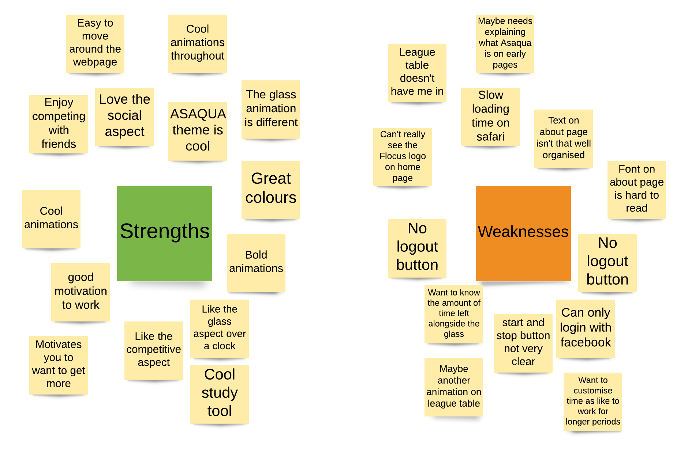

# Evaluation [15%]

## Contents of Evaluation

- [**Details of design evaluation**](#Details-of-design-evaluation)
    - [Timeline](#Timeline)
- [**Unit/Functional testing**](#Unit/Functional-testing)
- [**User acceptance testing**](#User-acceptance-testing)

# Details of design evaluation 

# Unit/Functional testing

When developing any software, it is key to consider testing to pick up an bugs or errors in the software code. When developing a single page application with a clear focus on user experience, functional testing is key to avoid the end-user coming across any bugs/errors. 

Often a user will be put off by the simplest of bugs. There is a level of trust between the user and organisation; if they come across errors they may not trust the organisation to store important data i.e. in our example it is handling their login details but in future development this could include payment data. Therefore, testing is critical to software success, particualrly with a single poage application focused on user experience. 

## Cross Browser Compatibility testing

TODO - Sam

# User testing

Due to our target end user being the same demographic as every team member, we were fortunate to have abundance of possible end-users to test out Flocus on. When setting out our usability testing plan, we wanted to focus on ensuring we had tested the following key points:

- Users can complete the main action of using the visual aid as a study tool
- Users can navigate the pages easily 
- Don't come across any significant bugs/errors
- Have an enjoyable experience of Flocus

## User acceptance testing

### Alpha testing

Throughout the development process, Sam and Hugh focused on building and running Flocus to ensure there were no bugs in the code by testing out manual scenarios. As we approached the end of the development sprints, Hugh and Sam worked together to devise several possible user scenarios and flows from the landing page. These test cases were based off the user stories/personas created when designing the front-end. 

Please see below a table summarising some of the key user test cases along with pass/fail:

TABLE - TODO

This helped pick up minor bugs, including:
- issues with the glass filling up animation
- issues with the font and size of some of the text on the about page

One area that was also picked up was the compatability with different browsers. Having researched online, we realised this is a common error when working with Angular-CLI. Therefore, we have identified this as a future work on going forward. 

### Beta testing

As part of our user acceptance testing, we undertook field testing with real end-users. However, due to limited ethical approval and time restraints, we ran a single focus group with 8 friends and peers across Zoom. Focus groups are a great method to help understand user experiences and opinions of web applications. However, in the future we advice combining focus groups with interviews and questionairres to help avoid groupthink.

To ensure these individuals remained anonymous and we abide by ethical guidelines we did not record or take ask for any personal data from those involved in the focus group. Instead, we took written observation notes and asked individuals to anonymously add to a Lucidchart to help develop a version of an affinity chart.

The focus group focused on the following areas:
- thoughts on aesthetics of the web application
- possible user scenarios
- user walkthroughs

By focusing on the above areas, it made it easier to find any bugs and share anonymous opinions about the design and implementation of Flocus. To enable an effective and efficent focus group, we launched a live version of Flocus through Heroku. 

Gordon - heroku - TODO

After completing user walkthroughs, which has motivated some minor changes as listed in the sprints section and the future development section, we then asked the focus group to contribute to an affinity diagram on the strengths and weaknesses of Flocus. 

Please see below the affinity diagram using Lucidchart:

<b>
 Figure : Affinity diagram from user feedback 
</b>

The key improvement points identified from the focus group, include the following:

- greater personalisation with ability to select work time
- ability to be in the league table with their friends
- timer alongside glass to help know time instead of guessing
- Facebook logout button missing

#### Future methods

Possible types of future user testing, include:

- Surveys - help understand user experience.
- A/B testing - experiemtn with different versions
- Heat map testing - help undersatnd how users move about the web page
- Further in house testing

Please see the conclusion section to learn more about future evaluative technqiues.

# Project report navigation

- [Next page: Conclusion](https://github.com/STF1998/Desk20/blob/main/report/conclusion.md)
- [Previous page: Sprints and Project Management](https://github.com/STF1998/Desk20/blob/main/report/sprints%26ProjectManagement.md)
- [Go back to Homepage](https://github.com/STF1998/Desk20)