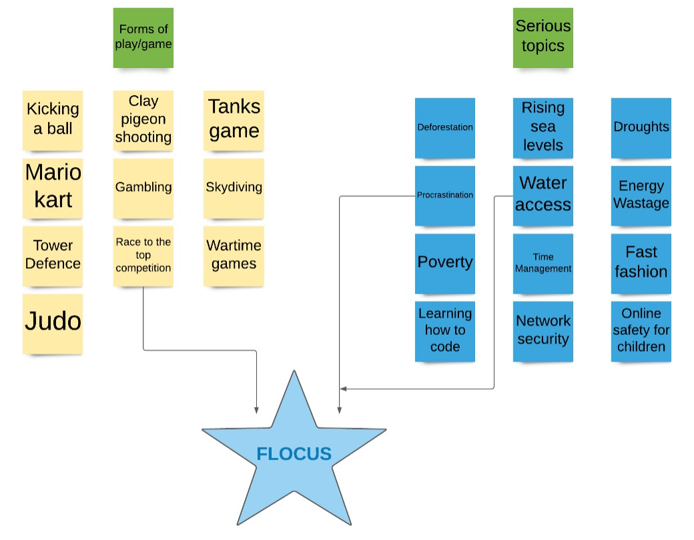

# Introduction [10%]

## Contents of Introduction
- [**Abstract**](#Abstract)
  - [Motivation for the project](#Motivation-for-the-project)
  - [The problem we aim to solve](#The-problem-we-aim-to-solve)
  - [High level overview of our project](#High-level-overview-of-our-project)
- [**Project Objectives**](#Project-Objectives)
  - [High level aims and goals](#High-level-aims-and-goals)
  - [How are we solving the problems?](#How-are-we-solving-the-problems)
  - [Team checklist](#Team-checklist)
- [**System Explanation Video**](#System-Explanation-Video)
  - [Video link](#Video-link)

## Abstract

### Motivation for the project

<b>
 Figure 1: Lucidchart of the initial ideation stage. 
</b>

The team began the project by drafting up ideas around playful ideas and serious world issues, shown by Figure 1. Given limited time and resources, we swiftly aimed to define a simple but effective project idea that solved a critical issue but, also had a playful aspect. Having drafted several ideas, we quickly decided to focus on solving an issue that we all understood and had experienced at some point in our lives: procrastination. Secondly, after analysing various game ideas, we decided the most suitable and simple idea would be to create a competitive aspect, based on avoiding procrastination. 

However, while we had defined the two key aspects required by the project brief, we quickly realised we could solve a critical issue in procrastination but also raise awareness for an issue slightly further afield: water scarcity in developing nations. Fortunately, Gordon, one of our team members, had founded his own NGO (non-governmental organisation) called Asaqua that provides affordable solutions to the water crisis in Africa. 

### The problem we aim to solve

FLOCUS solves two problems identified in the research and ideation stage:

-	The widespread problem of procrastination amongst university students, particularly with an increase of students working on devices accentuated by the COVID-19 pandemic.

-	Severe lack of awareness for water scarcity in Africa.

### High level overview of our project

From this development of the ideation stage, we produced FLOCUS, a single page application that aims to combat procrastination for university students while raising awareness for Asaqua and water scarcity. The single page application will be focused on a simple glass that is filled up with water, from a tap, as you work. The glass will fill up every study interval followed by the user being encouraged to take a short break to relax from work. The page will include a login through Facebook, which will allow the page to display a league table to encourage competitiveness between friends on how much work they are doing. Our initial aim was to integrate a google ads area to raise funds for Asaqua however, this has been included as an opportunity for future development work.  

## Project Objectives

### High level aims and goals

#### Main goal of the project

Build a MEAN stack single page application with integration of a front end (using Angular-CLI), including a responsive design, with a Facebook API to provide a login capability and league table between friends. 

#### High level project aims

- Help solve procrastination in university student populations by providing a visual aid to help students study for a time interval (following the Pomodoro technique). 

- Raise awareness for water scarcity and ASAQUA, an NGO (non-governmental organization) working to solve the water crisis in underdeveloped nations across Africa. 

- Integrate a table/chart to represent a competitive aspect between friends to encourage competitiveness and work ethic amongst student populations. 

### How are we solving the problems?

To help reduce procrastination in student populations, we are building a single-page application that allows students to use a visual aid of a glass filling up, to help them work for a period of time,followed by a break. This has been inspired by the time management method called the Pomodoro Technique and the use of intervals to help students work for an interval combined with rewards of a break. We have decided to use a visual aid of a glass filling up so students have a visual representation of their progress and with its link to water given the key message of our web application:

Solving procrastination and water scarcity, one glass at a time!

While students are working, the google ads section will be generating revenue which will be donated to Asaqua. Therefore, students not only have the satisfaction of working towards a target and rewarded with a break but are also rewarded by the fact they are actually contributing and helping raise funds for an important issue in water accessibility. It is a win-win scenario for all parties involved. 

To further encourage students to use Flocus, we are integrating a Facebook login to allow students to compete with their friends on how much time they are committing to work but also how much they are raising for charity by using our website. The competitive nature will further encourage students to increase their productivity but also return and use the application on future occasions rather than being a one-stop shop.

### Team checklist

See the following key points that we used as a checklist to keep the team motivated to succeed in this project: 

- Build a working single page application that was both a procrastination tool and raises awareness for water scarcity in underdeveloped nations. 

- Build extensive and attractive animations for the front-end with quick loading pages. 

- Integrate the single page application with Facebook-API for login capability.

## System Explanation Video

### Video link

See the video link below showing a short explanation of our system and how we envisage consumers using FLOCUS.

TODO --> [This will be a youtube link to a short screen recording of using our webpage.] 

## Project report navigation

- [Next page: Background and Motivation](https://github.com/STF1998/Desk20/blob/main/report/backgroundAndMotivation.md)
- [Go back to Homepage](https://github.com/STF1998/Desk20)
