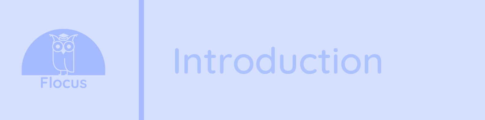

# 1. Introduction

## Contents of Introduction
- [**a. Abstract**](#a.-Abstract)
  - [Motivation for the project](#Motivation-for-the-project)
  - [The problem we aim to solve](#The-problem-we-aim-to-solve)
  - [High level overview of our project](#High-level-overview-of-our-project)
- [**b. Project Objectives**](#b.-Project-Objectives)
  - [High level aims and goals](#High-level-aims-and-goals)
  - [How are we solving the problems?](#How-are-we-solving-the-problems?)
  - [Team checklist](#Team-checklist)
- [**c. System Explanation Video**](#c.-System-Explanation-Video)
  - [Video link](#Video-link)

# a. Abstract

## Motivation for the project

<b>
Figure 1: LucidChart of idea creation stage
</b>

The team begun the project by drafting up ideas around playful ideas and serious world issues, shown by Figure 1. Given limited time and resources we swiftly aimed to define a simple but effective project idea that solved a critical issue but also had a playful aspect. Having drafted several ideas, we quickly decided to focus on solving an issue that we all had an understanding of and had experienced at some point in our lives: procrastination. Secondly, after analysing various game ideas we decided the most suitable and simple idea would be to create a competitive aspect based on avoiding procrastination. 

However, while we had defined the two key aspects required by the project brief, we quickly realised we could solve a critical issue in procrastination but also raise awareness for an issue slightly further afield: water accessibility in developing nations. Fortunately, Gordon, one of our team members, had founded his own NGO called Asaqua that provided affordable solutions to the water crisis in Africa. 

## The problem we aim to solve

FLOCUS solves two problems identified in the research and ideation stage:
-	The serious problem of procrastination amongst students, particularly with an increase of students working on devices accentuated by the COVID-19 pandemic.
-	Lack of awareness for water accessibility in Africa

## High level overview of our project

From this development of the ideation stage, we came up with FLOCUS, a single webpage application that aims to combat procrastination for students while raising awareness for Asaqua. The single page application will be focused on a simple glass of water filling up from a tap as you work. The glass would fill up every 1hr and then the user is encouraged to take a 5-10 min break to relax from work. The page will include a login through Facebook, which will allow the page to display a table to encourage competitiveness between friends on how much work they are doing without procrastination. We will have a google ads area to raise funds towards Asaqua with a pop up educating on the work Asaqua are doing to combat water accessibility in Africa. 

# b. Project Objectives

## High level aims and goals

## How are we solving the problems?

# c. System Explanation Video

## Video link

See the video link below showing a short explanation of our system and how we invisage consumers using FLOCUS.

TODO --> [This will be a youtube link to a short screen recording of using our webpage.] 

