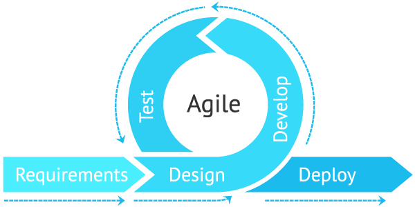

# Sprints and project management [15%]

## Contents of Sprints and project management
- [**Group working methods**](#Group-working-methods)
  - [Overview](#Overview)
  - [Agile methodology](#Agile-methodology)
  - [Communication channels](#Communication-channels)
- [**Meet the team**](#Meet-The-Team)
- [**The Sprints documentation**](#The-Sprints-documentation)
  - [Sprint 1 - An Early Setback and The Ideation Process](#Sprint-1---An-Early-Setback-and-The-Ideation-Process)
  - [Sprint 2 - Angular and API setup](#Sprint-2---Angular-and-API-setup)
  - [Sprint 3 - Facebook API issues and Design Time](#Sprint-3---Facebook-API-issues-and-Design-Time)
  - [Sprint 4 - The Study Component and MongoDB](#Sprint-4---The-Study-Component-and-MongoDB)
  - [Sprint 5 - Bringing Things Together](#Sprint-5---Bringing-Things-Together)
  - [Sprint 6 - The League Table and Databases](#Sprint-6---The-League-Table-and-Databases)
  - [Sprint 7 - The Final Countdown](#Sprint-7---The-Final-Countdown)
- [**Team use of Git**](#Team-use-of-Git)

## Group Working Methods

### Overview

When developing a single page application, it is critical to consider development methodology, particularly given the large number of moving parts associated with full-stack development. When discussing the development stage, we discussed the pros and cons of an agile vs waterfall methodology before agreeing on the agile approach. The waterfall approach is focused more on a rigid structure of tasks that lead to a final product whereas an agile approach prioritises a more flexible and iterative process to software development. To learn more about development methodologies, please check out this [link](https://www.wrike.com/project-management-guide/methodologies/) that we found very useful.

Check out the Figure 1 below that helps explain the difference in the methodology approaches (Source: [link](https://saigontechnology.com/blog/agile-vs-waterfall-in-software-development)).

<b>
 Figure 1: Agile vs Waterfall methodology. 
</b>

### Agile methodology

We focused on an agile methodology that allowed for an iterative and flexible process as well as a greater focus on user interaction. An agile methodology allowed us to effectively and efficiently respond to adversity and challenges throughout the project. One aspect we really enjoyed, as a team, was the iterative aspect and opportunity to provide ideas on improvement from a wide range of perspectives. This led to a better and improved application after each development sprint. 

When approaching the development stage, we were naturally developing a plan around the SCRUM framework. While there are multiple frameworks that come under the agile methodology, the SCRUM framework suited this project because it provided the development team with a flexible and iterative process but gave each individual deadlines and targets to hit, something critical given the current climate of working from home. Each individual in the team had their role and targets but also had a strong understanding of what other team members were doing. This approach allowed us to focus on quality with the flexibility to change priorities as a team when challenges occurred or we wanted to focus on a specific area before moving onto the next.

Initially, as a team we sat down (albeit virtually) and wrote a list of the key features and components that we wanted FLOCUS to include. We finalised our user personas and basic wireframes, which can be seen here (TODO). The below diagram ([link](https://devcom.com/tech-blog/agile-advantages-for-business/)) is a graphical representation of the cycle of agile development we aimed to follow as a group in the design, development and implementation of our product.

<b>
 Figure 2: Agile methodology cycle 
</b>
 

Below, you can see more about the breakdown of our sprints.

### Communication channels

Due to the COVID-19 pandemic, our team has been working from home throughout the project. This meant that our communication and the channels we used were key to ensuring we worked well as a team. The two main channels we used were Microsoft Teams and Discord. Our Teams group at desk 20 allowed us to organise video calls, share documents and speak to the lecturing team. However, our most commonly used channel was our Discord chat where we regularly had conversations about specific areas of the project as well as organising voice and video calls to discuss specific areas of development. While it was tough initially to bond as a team, these channels did help us get to know each other and became a driving force as we began our development sprints.

<b>
 Figure 3: Our Discord Chat Setup 
</b>

The above image displays our discord chat set-up. Initially, all project discussion took place in the general chat. However, once we upped the tempo of work and thus the frequency of chatter, important messages quickly became lost amid the daily discussions. After spending longer than needed searching for a previous message, Hugh, Flocus front-end developer, set-up separate chat rooms and the whole group endeavoured to stick to a strict chatroom regime. This also helped us to cut down on procrastinating chat.

 

## Meet The Team

<table>
<tr>
  <th>      Name      </th>
  <th>Photo</th>
  <th>Team role</th>
  <th>Biggest lesson learnt during the project</th>
</tr>
<tr>
  <td> Sam Fitton </td>
  <td></td>
  <td>Sam's role has been focused on full-stack development with a focus on designing the front-end and integrating Facebook's log-in onto the page. </td>
  <td> Learning how to implement animations with CSS and typescript to bring HTML elements to life. </td>
</tr>
<tr>
  <td> Hugh Hamilton-Green </td>
  <td></td>
  <td> Hugh's role has been focused on the front-end design and implementation alongside keeping up-to-date with documentation and ensuring the construction of report alongside development. </td>
  <td> I really enjoyed learning about end-to-end development with a focus on user experience (UX).</td>
</tr>
<tr>
  <td> Jati Wicaksono </td>
  <td></td>
  <td> Jati's role has been focused on the back-end with particular focus on building our API and integrating with Facebook's API allowing login usability on the page. </td>
  <td> Learning how to implement a RESTful API and accessing external API's. </td>
</tr>
<tr>
  <td> Gordon Tse</td>
  <td></td>
  <td> Gordon's role has been focused on the back-end with particular focus on the database and integration with the Facebook API and data upkeep. </td>
  <td> Building future-proof and flexible data models that allow multiple components to access data efficiently. </td>
</tr>
<tr>
  <td> Tom Cockain </td>
  <td></td>
  <td> Tom's role has been focused on integration of front and back-end and aiding Gordon with the database and how we display the selected data on the front-end. </td>
  <td> Understanding how a robust API is key to efficiently adding new features to an application. </td>
</tr>
</table>
 

 

## The Sprints Documentation

Throughout development, we consulted prospective users so to continuously tailor our design. At the end of each sprint, we received feedback from these individuals on our previous progress and adapted our development in response to their constructive criticisms. For ethical reasons, we cannot provide any personally identifiable information, although we have included their feedback and our subsequent development responses at the end of each section. For reference, we have provided these individuals’ personal choice of nickname: 

<ul>
  <li>User 1 - Cheese</li>
  <li>User 2 - Mr Water</li>
  <li>User 3 - Toast</li>
</ul>

 

### Sprint 1 - An Early Setback and The Ideation Process

##### 26th February – 5th March

Once we had fully understood the project specification and met with everyone in our group (albeit virtually), we started the ideation process. We were eager to work with an external partner as we hoped to convert the upcoming project into a real-world application. We had the initial idea of working with Ecosia, the eco-friendly search-engine seeking to tackle deforestation and climate change. However, after being in communication with their team, our hopes of working with them quickly faded as they were unable to designate resources to onboard us with their databases. We organised a meeting at Desk 20 on Monday morning to discuss the matter and revisit the ideation process. We identified some key objectives for that week:

<ul>
  <li>Revisit the idea matrix and consider new ideas</li>
  <li>Speak to friends and family about proposed ideas</li>
  <li>Finalise the ideation process by the end of the week</li>
  <li>Send out questionnaires to gauge market demand</li>
</ul>

With some creative thinking, we eventually came to the idea of Flocus. Gordon proposed the idea to the Asaqua team and fortunately, they were very keen to take on the proposed project with us. We gained some qualitative feedback on our initial proposal from our end-user group. This is displayed below:

 

  <table>
  <tr>
    <th>User</th>
    <th>Feedback</th>
  </tr>
  <tr>
    <td> Cheese </td>
    <td>
      <ul>
        <li>Found the idea interesting</li>
        <li>Thought that UX will be important</li>
        <li>Cheese has a problem with procrastinating on deadlines and thought this idea would address this issue</li>
      </ul>
    </td>
  </tr>
  <tr>
    <td>Mr Water</td>
    <td>
      <ul>
        <li>Liked the idea</li>
        <li>Concerned about it being distracting</li>
        <li>Thought that it was important to be raising awarness for water scarcity</li>
      </ul>
    </td>
  </tr>
  <tr>
    <td>Toast</td>
    <td>
      <ul>
        <li>Unsure if it would be well recieved by the market</li>
        <li>Was interested to give it a couple of weeks trial</li>
      </ul>
    </td>
  </tr>
  </table>

 

Generally, we received enthusiastic responses to the idea with constructive critism often concerning the hurdles of implementation. We noted the feedback regarding UX and distraction and, designed the upcoming study component to address these concerns. 

### Sprint 2 - Angular and API setup

##### 19th March – 26th March

To make a start, we held an initial development meeting to discuss the components required to begin back- and front-end development. We knew that we were going to have to implement a database for storing glass count data and personal statistics and so an API was required. We identified our week’s objectives:

<ul>
  <li>Generate all required components to kickstart the development process</li>
  <li>Make a start with the study component</li>
  <li>Create our RESTfull API</li>
  <li>Familiarise with the Facebook API and how to access it</li>
  <li>Set-up the general environment: Connect express with docker and MongoDB</li>
  <li>Review feedback from questionnaires</li>
</ul>

### Sprint 3 - Facebook API issues and Design Time

##### 26th March – 2nd April

During the initial stages of development we were able to produce a preliminary design for the home component. This is displayed in the .gif below.

 

  
   
  <b>Video: Initial Home design </b>
    

 

Whilst we continued the design of the study component, which was taking longer than expected, we offered the home page to the user group for feedback. We wanted to know if the home component was appropriately designed, given the aim and theme of the application. We recieved the following feedback:

 

  <table>
  <tr>
    <th>User</th>
    <th>Feedback</th>
  </tr>
  <tr>
    <td> Cheese </td>
    <td>
      <ul>
        <li>Thought the design is visually pleasing</li>
        <li>Was unsure if it fits into the theme of the website</li>
        <li>What is the floating object?</li>
        <li>Thought that it doesn't really stay with the theme of water</li>
      </ul>
    </td>
  </tr>
  <tr>
    <td>Mr Water</td>
    <td>
      <ul>
        <li>Good</li>
        <li>Thought that it may offer a distraction before you start your revision</li>
        <li>Could sit and watch the animation for a long time if bored</li>
      </ul>
    </td>
  </tr>
  <tr>
    <td>Toast</td>
    <td>
      <ul>
        <li>Looks proffessionally done</li>
        <li>Was unsure if it sticks to the theme</li>
      </ul>
    </td>
  </tr>
  </table>

 

The feedback from the user group generally hinted that we needed to head back to the drawing board. Although it was disappointing that our first attempt was not adequate for the users’ expectations, it was important that we took constructive criticism onboard to pursue a design that fulfilled our project aims. Subsequent to this, we called a meeting to organise the following actions and events for the week ahead:

<ul>
    <li>Adjust the Home component design to user group feedback</li>
    <li>Complete the Study component front-end development</li>
    <li>Speak to Course Admins regarding the Facebook authentication process</li>
    <li>Further research on how to implement the Facebook authentication process</li>
</ul>

By this point, Jati, who was handling the Facebook log-in process, had made considerable progress in understanding the relevant API and was able to implement his findings as we moved into Sprint 4.

Regarding this implementation, the initial struggle was to fully understand the API that we were trying to connect to, and the tools required to achieve this which, was Facebook’s API and PassportJS. However, as Facebook’s API and PassportJS have extensive online documentation that is accessed through the web, it helped us to overcome this issue. Furthermore, as these technologies are highly popular, there is a good availability of tutorials and previously posted troubleshooting problems.
 
However, as we progressed, we realised that there was another problem above the API connection and requesting data. To be able to utilise Facebook’s API, we had to first understand and abide by their terms and regulation regarding to the API for authentication. This included the following information: 

<ul>
    <li>The types of permissions that we needed to include so that FB’s API would return the required data </li>
    <li>How to simulate and test our application, as Facebook does not let any real user other than the app’s admin login to the application during development mode</li>
    <li>The deployment procedure - it turns out that Facebook follows an application review process before any real user can use the application</li>
</ul>

After further research, it became clear that Facebook is strict and careful about letting other applications access their users’ data. Nonetheless, if the procedure provided is followed, there should be no problem when using their API. Facebook provide up to 2000 easy to use and configure test users that we utilised to test the app. The subsequent steps of the implementation were to follow the PassportJS documentation and tutorials online.

### Sprint 4 - The Study Component and MongoDB

##### 9th April - 16th April

To kickstart the week we had our normal Monday morning call on teams and discussed the upcoming weekly tasks:

<ul>
    <li>Complete the study component design and offer this to the user group for feedback</li>
    <li>Convert some of the animations in the study component to typescript for user interaction and full site functionality. </li>
    <li>Begin the design process for the league component and navigation panel</li>
    <li>Model the user and record database</li>
    <li>Facebook's authentication and data collection through passportJS</li>
</ul>

The front-end development process had seen success in the implementation of the study component – all CSS animations had been applied successfully to the isolated SVG layers and the component had a natural flow. Additionally, the Home component had been adjusted to the previous feedback of the user group. As such, it was time to integrate user interaction into the site, with particular attention on the study component. The League and navigation panels also needed to begin their development process. Difficulty was encountered when implementing the water fill and tap animation in typescript. The front-end had to learn how to deal with document object model (DOM) elements to manipulate the html structure and perform transformations. As a result of this difficulty, we were unable to provide a full working draft to the user group and instead offered a preliminary design with CSS keyframe animations. A screenshot of this design is displayed below with our user group feedback:

 

<b>
 Figure 4: The Initial Study Component 
</b>

 

  <table>
  <tr>
    <th>User</th>
    <th>Feedback</th>
  </tr>
  <tr>
    <td> Cheese </td>
    <td>
      <ul>
        <li>Thought it was well designed</li>
        <li>Found the study component relaxing</li>
      </ul>
    </td>
  </tr>
  <tr>
    <td>Mr Water</td>
    <td>
      <ul>
        <li>Their university room overlooks a road - they thought that the study component would create a calm enviroment to study in</li>
        <li>Thought that the animations were slow and not distracting</li>
      </ul>
    </td>
  </tr>
  <tr>
    <td>Toast</td>
    <td>
      <ul>
        <li>Thought that it Looked proffessionally done</li>
        <li>Was worried that they wouldn't know what to do if they had to use it</li>
      </ul>
    </td>
  </tr>
  </table>

 

We found this feedback very encouraging as it mirrored the impact and theme that we were attempting to create. However, we did adjust the final design to reflect Toast’s feedback and included signing to better inform a potential user. 

In the backend development, one of the key challenges in this sprint was to figure out the logic to correctly store data returned from Facebook with a well-thought-out data model. Not only did we have to ensure the data in our database is always up-to-date, but also to make the data model flexible and future-proof. We had not decided how other components will be interacting with the database at that time, so we went for the normalised approach even though we have a NoSQL database. During this sprint, we were mainly using Postman to test the functionality of Passport.js instead of connecting to the database instance right away, which can visualise the behaviour of the Passport.js and helped the developer to learn using it.

### Sprint 5 - Bringing Things Together

##### 16th April - 23th April

Sprint 5 took us into the second half of our development process. We started to become more aware of the looming deadline and as a result, pushed forward to achieve a minimum viable product. This meant bringing all previously designed components together with app-routing and a navigation panel. Most tasks from the previous sprint were carried over however, in our Monday morning stand-up, we identified some new tasks that are displayed below:

<ul>
    <li>Learning Javascript for error handling and data processing</li>
    <li>Learning the process of calling an API request and getting the data on the frontend side</li>
    <li>Learning MongoDB functions to be able to connect and collect data from database</li>
    <li>Include Asaqua page for user education and water scarcity awareness</li>
</ul>

The Facebook API implementation was nearly complete, although, there were a few related issues that needed to be addressed in Sprint 5. In terms of coding, the struggle was after we successfully implemented facebook’s API and were able to retrieve simple data from it, such as; the user’s name, the authentication token, and user’s Facebook id. However, when we tried to retrieve more complex data which, was in the form of an object, array, or an array inside an object, it was harder to achieve error handling. Error handling, in this case, is to take care of a null variable or array element. For instance, some people have data inside their friends’ array, but some do not. Some people also have a middle name, but some do not. This issue was far trickier to address than initially expected which was partially due to our lack of prior knowledge in Javascript. However, after doing further research, hands-on debugging, and contacting a helpful teaching assistant (shout out to Marceli), this problem no longer exists. 

A further struggle was to implement a simple routing mechanism on Angular. Making Angular automatically route from the Login to the Home component once the user had successfully logged in via Facebook was challenging. Understanding and implementing the user status checker inside an Angular page/component was a struggle. However, Angular documentation and online forums such as Stack Overflow helped us troubleshoot this problem. 

### Sprint 6 - The League Table and Databases

##### 23rd April - 30th April

Sprint 6 marked the penultimate week of development and we realised that there was still much to achieve before we could perceive the project as complete. For the upcoming week, we noted the following tasks and set about getting as much done as possible: 

<ul>
    <li>Create post requests to store data created in the front-end for persistent storage</li>
    <li>Creating multiple get requests so that the data in the database could be accessed from Angular</li>
    <li>Implement error handling and data processing algorithms</li>
    <li>Implementing data access from different components with the successful login status</li>
    <li>Check functionality of front-end with a variety of devices and with widely used browsers</li>
    <li>Launch our application on Heroku in preparation for the focus group participants</li>
    <li>Receive feedback on the League table and Asaqua components from the User Group</li>
</ul>

During this sprint, we implemented most of the middle tier RESTful APIs, which are the bridges between the components and the database. The frontend components of our application do not directly access the APIs but through the Angular data service. Although we tested our RESTful APIs as Passport.js in the previous sprints, we struggled to pass the request body to the API through the Angular HTTP client. Whilst we were testing our get requests to the APIs with Postman, we passed a request body in JSON format to the API as parameters to the MongoDB Query. However, we did not realise that the Angular HTTP client does not support sending a request body, which causes the API to receive undefined values as the parameters. Eventually, we found a workaround to pass the necessary parameters as HTTP params via the data service. It took some time for our developers to figure out what was happening, so the related tasks in this sprint had a slight delay in delivery.

After having the necessary APIs functioning as planned, the study and the league components required the successful login status given in the login process. They also need the UID as the key to the Record collection. We then created several more get requests to confirm the login status and retrieve the UIDs for those components. We also soon realized that just relying on the UID as a key to get the league table, which involves looping and sorting, was rather computationally complex (in the worst case the complexity is O(n^2n) which, might hinder our server’s reliability). Therefore, we reconstructed the MongoDB query to become multi-staged, leaving all the complex computation to MongoDB to speed up the data retrieval process.

As for the front-end development, We did not want to trouble our user group too many times and, as such, decided to only ask for their feedback once more. Considering that this would be our final feedback before we ran our closing focus group, we wanted to ensure that we presented a site that was as close to the final product as possible. Towards the end of Sprint 6, we asked for feedback on two components: the Asaqua and the League components. The draft designs that we presented are displayed below:

 

<b>
 Figure 5: The Initial Asaqua Component
</b>

 

<b>
 Figure 6: The Initial League Component
</b>

 

  <table>
  <tr>
    <th>User</th>
    <th>Feedback</th>
  </tr>
  <tr>
    <td> Cheese </td>
    <td>
      <ul>
        <li>Thought that the Asaqua page was clean and informative</li>
        <li>Would have been nice to see a link to Asaqua</li>
        <li>Commented on the league table, saying that the page felt incomplete</li>
        <li>Suggested another personal stats section on the league component</li>
      </ul>
    </td>
  </tr>
  <tr>
    <td>Mr Water</td>
    <td>
      <ul>
        <li>Thought that the Asaqua component did an important job - no further comments</li>
        <li>Really liked the league table page, although said that it looked slightly bare</li>
      </ul>
    </td>
  </tr>
  <tr>
    <td>Toast</td>
    <td>
      <ul>
        <li>Asaqua page is good but could do with a link to the NGOs website</li>
        <li>Suggested that we may need to provide more information on Asaqua</li>
        <li>Positively commented on the league table</li>
      </ul>
    </td>
  </tr>
  </table>

 
 

This feedback was pivotal in finalising our designs. As we moved into Sprint 7, we implemented the suggested changes by adding a link to the Asaqua page and providing more information on the NGO and it’s activities. We investigated the prospect of delivering further metrics for the personal stats area but unfortunately, we decided that we did not have enough remaining time given our current workload. Instead, we repurposed the code used in the log-in component for the lottie animation and placed this on the bottom left of the screen which, brought the page to a finished product. This was great feedback as it led as to furthering our goal of implementing serious play in our application. 

### Sprint 7 - The Final Countdown

##### 30th April - 7th May

Our final sprint, Sprint 7, was characterised by the evaluation and final write-up of our report. We had maintained a good level of documentation throughout the project and so, the final writing was almost exclusively confined to the Evaluation, Sprints and our project conclusion. We have listed the final tasks that we identified as mandatory before the project deadline, all of which have been completed:

<ul>
    <li>Completion of testing from Sprint 6 </li>
    <li>Continue adapting code to our test results</li>
    <li>Hold a final focus group for our study participants to gain some insight into how well received the application is</li>
    <li>Pass on any interesting findings from the focus group to Asaqua if adjustments cannot be made prior to the deadline</li>
</ul>

 

## Team use of Git

Our team created a remote repository on GitHub for collaboration and version control. The branches in our repository are the main branch and different personal branches. We used the main branch to maintain our latest production-ready working copy. During the sprints, each of our developers had their personal feature branch, where we made frequent commits to achieve effective version control. Once the newly developed features were ready to merge with the production-ready working copy on the main branch, we submitted a pull request and informed the entire team about the incoming changes. Following this, all developers were able to pull from the latest version, review the code and test the latest working copy with Docker.

<b>
 Figure 7: Diagrammatical representation of our GitHub repository 
</b>

 

## Project report navigation

- [Next page: Evaluation](https://github.com/STF1998/Desk20/blob/main/report/evaluation.md)
- [Previous page: UX Design](https://github.com/STF1998/Desk20/blob/main/report/UXDesign.md)
- [Go back to Homepage](https://github.com/STF1998/Desk20)
