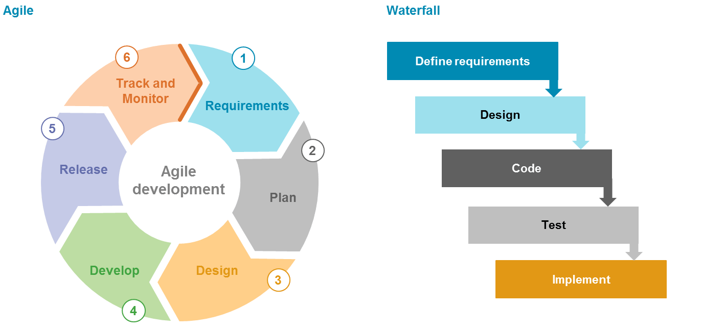

# Sprints and project management [15%]

## Contents of Sprints and project management
- [**Group working methods**](#Group-working-methods)
  - [Overview](#Overview)
  - [Agile methodology](#Agile-methodology)
  - [Communication channels](#Communication-channels)
- [**Meet the team**](#State-of-the-art-survey)
- [**Sprints documentation*](#Sprints-documentation)
- [**Use of Git**](#Use-of-Git)

## Group Working Methods

### Overview

When developing a single page application, it is critical to consider development methodology, particularly given the large number of moving parts associated with full-stack development. When discussing the development stage, we discussed the pros and cons of an agile vs waterfall methodology before agreeing on the agile approach. The waterfall approach is focused more on a rigid structure of tasks that lead to a final product whereas an agile approach prioritises a more flexible and iterative process to software development. To learn more about development methodologies, please check out this [link](https://www.wrike.com/project-management-guide/methodologies/) that we found very useful.

Check out the Figure 1 below that helps explain the difference in the methodology approaches (Source: [link](https://saigontechnology.com/blog/agile-vs-waterfall-in-software-development)).

<b>
 Figure 1: Agile vs Waterfall methodology. 
</b>

### Agile methodology

We focused on an agile methodology that allowed for an iterative and flexible process as well as a greater focus on user interaction. An agile methodology allowed us to effectively and efficiently respond to adversity and challenges throughout the project. One aspect we really enjoyed, as a team, was the iterative aspect and opportunity to provide ideas on improvement from a wide range of perspectives. This led to a better and improved application after each development sprint. 

When approaching the development stage, we were naturally developing a plan around the SCRUM framework. While there are multiple frameworks that come under the agile methodology, the SCRUM framework suited this project because it provided the development team with a flexible and iterative process but gave each individual deadlines and targets to hit, something critical given the current climate of working from home. Each individual in the team had their role and targets but also had a strong understanding of what other team members were doing. This approach allowed us to focus on quality with the flexibility to change priorities as a team when challenges occurred or we wanted to focus on a specific area before moving onto the next.

Initially, as a team we sat down (albeit virtually) and wrote a list of the key features and components that we wanted FLOCUS to include. We finalised our user personas and basic wireframes, which can be seen here (TODO). The below diagram ([link](https://devcom.com/tech-blog/agile-advantages-for-business/)) is a graphical representation of the cycle of agile development we aimed to follow as a group in the design, development and implementation of our product.

<b>
 Figure 2: Agile methodology cycle 
</b>

Below, you can see more about the breakdown of our sprints (TODO link here).