# System Implementation [20%]

## Contents of System Implementation

- [**Stack architecture and system design**](#Stack-architecture-and-system-design)
  - [Stack arcitecture](#Stack-arcitecture)
  - [System design](#System-design)
  - [Class diagrams](#Class-diagrams)
  - [Sequence diagrams](#Sequence-diagrams)
- [**Back End - MongoDB**](#Back-End---MongoDB)
  - [Database implementation](#Database-implementation)
  - [Data model](#Data-model)
- [**Middle Tier**](#Middle-Tier)
  - [Express](#Express)
  - [Node](#Node)
  - [The RESTful API](#The-RESTful-API)
- [**Front End**](#Front-End)
  - [Angular](#Angular)
  - [Details of implementation](#Details-of-implementation)
- [**Additional Elements and Components**](#Additional-elements-and-components)
- [**Deployment Details**](#Deployment-Details)

## Stack architecture and system design

### Stack architecture

Our team decided to use MEAN stack for developing this project. MEAN stands for MongoDB, Express, Angular, and Node.js. Even though the stack consists of multiple technologies, all of them are based on one coding language, which is JavaScript. The roles of each technology is:

-	MongoDB: Database solution
-	Express: NodeJS framework to simplify http request and response
-	Angular: Front-end browser-side framework
-	Node.js: Runtime server-side code

Below is a diagram displaying how each of the technologies within the stack interact:

<b>
Figure 1: Stack diagram 
</b>

MEAN stack was chosen due to its advantages, including:
-	It has a large and helpful online community. There are several tutorials, lectures, and problem-solving articles or videos about MEAN stack on the web. 
-	Single programming language – this helps to create an easy working environment for full stack development.
-	Supports automated testing – ensures readily available quality checks.
-	Isomorphic coding – allows developers to switch to another framework without altering much of the original code.
-	Support from the faculty, as the lectures and support provided was focused on MEAN stack.

As a team we also did a bit of research on the different stacks, including MEVN and MERN:

<table>
<tr>
  <th>MEVN</th>
  <th>MERN</th>
</tr>
<tr>
  <td>
    <ul>
      <li> MongoDB </li>
      <li> Express </li>
      <li> Vue </li>
      <li> Node.js </li>
    </ul>
  </td>
  <td>
    <ul>
      <li> MongoDB </li>
      <li> Express </li>
      <li> React </li>
      <li> Node.js</li>
    </ul>
  </td>
</table>

The only difference between these stacks is the front-end framework. For this project, Angular was selected. In terms of the front-end, Sam and Hugh have really enjoyed developing a strong understanding of how the front-end works and Angular has ensured that we have a strong grasp of associated areas, including typescript.

According to the GitHub stars received on each of the front-end framework (Angular, React, Vue), Angular is the least popular. This is displayed in the graph below ([link](https://www.codeinwp.com/blog/angular-vs-vue-vs-react/)):

<b>
Figure 2: Number of stars on GitHub projects for Angular, React, and Vue
</b>

However, in terms of job searches on linked in, Angular is in first place ([link](https://zerotomastery.io/blog/tech-trends-showdown-react-vs-angular-vs-vue/)): 

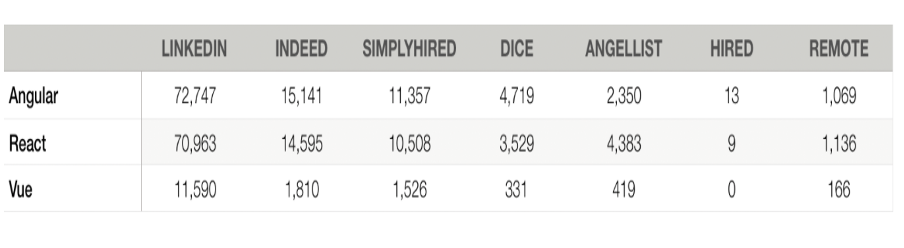

<b>
Figure 3: LinkedIn Searches (Data was taken collected on 10th December 2018) 
</b>

Ostensibly, the argument for using the MEAN stack was compelling, not only for the previously stated reasons but also because of the level of support offered by the university and our course peers. As such, we decided to adopt this approach for our project implementation. 

 

#### Stack architecture implementation in our application

Other than the previously discussed technologies, our application interacts with Facebook’s API. For this, we have used PassportJS which, is a Node.js authentication middleware that helps our app communicate with Facebook. To help with the visualisation of how our application works, We have included a diagram of the various technologies and communication branches associated with Flocus:

 

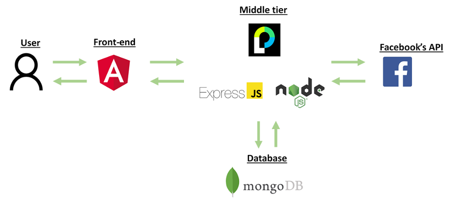

<b>
Figure 4: A visual representation of a user's interaction with Flocus 
</b>
 

### System design

#### Authentication design

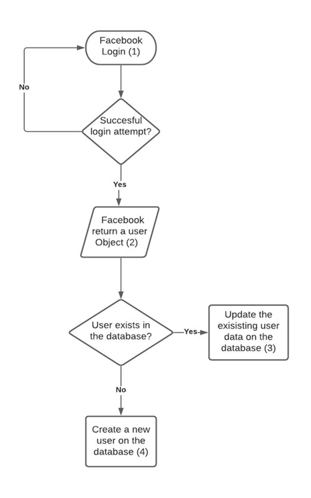

<b>
Figure 5: The authentication process
</b>

We decided to make Facebook’s (FB)’s authentication the only sign-in method to access our application. The reasons behind this are:
1.   FB’s API makes it convenient for users to find and connect with their friends on our app. The playful aspect of our application is to enable users to compete for the longest studying time among their friends and FB’s API automatically connects users with their friends on our application.
2.   FB’s API enables one-click signup/login and, can provide essential user data (e.g. user’s name, user’s FB profile pic) without manual user input during the registration process.
3.   FB’s API is well documented by Facebook. Furthermore, accessing FB’s API is made easy by PassportJS.
4. There is also an abundance of external support provided by people around the world in the form of videos, articles, and QnA.

The downside of using FB’s authentication is:
1.   If our app is in development mode, FB does not allow real FB users, other than the app administrator, to login to our application. However, FB provides up to 2000 test users for the purposes of testing our application. Further details are going to be discussed in the unit testing section.
2. To deploy our application, we need to follow FB’s app review process. Only after our application is approved, will real users be able to use our app.

The procedure to use FB’s API is as follows:
1. 	Create a FB account and go to the FB for developer’s site
2.	Create the application
3.  FB will return the ClientID number and Client Secret number. Enter the numbers into the PassportJS code when requested.
4.	Follow the step-by-step guide on FB authentication using PassportJS in PassportJS' documentation[http://www.passportjs.org/docs/facebook/].

When the login button in our application is clicked, the application will redirect the user to FB and asks the user to authenticate. Upon successful authentication, FB asks the user whether the they agree to share the requested data with the application. The details of this data are shown in a confirmation pop-up. If the login is not successful or the user does not agree to share their data, the user will be redirected back to our application’s login page.

The FB permission type in our code, determines the type of data that FB’s API will return to our application. Flocus only uses the "user_friends" permission, which means that FB will return an array consisting of all of the user’s friends. This also grants permission to the application. Additionally, there are types of data that do not require a permission to be returned. These include; user’s name, user’s UID (FB’s user unique id), user’s profile picture (in the form of link), and the authentication token. Amazingly, PassportJS provides a function called “isAuthenticated()”, which returns true if the user is already authenticated and the session is still alive. It will return false if the user is not authenticated or the session is expired. Therefore, in our application we do not have to worry about authentication tokens because we always call the “isAuthenticated()” method before letting the user access data from our database.

After FB returns the user object to our application, we then do a check on our database by checking the UID of the user and comparing it with every UID inside the database. If the user already exists, we only modify the list of friends of the user. However, if the user hasn't been previously recorded, we enter them into our database. Details of the user schema and PassportJS will be discussed further on in the database and middle tier sections.

Successful and unsuccessful login attempts will redirect users back to the login page. Our login page checks the “isAuthenticated()” method each time it is called and if it returns true then the user is redirected to our home page. If it returns false, the user is returned to our login page. Our application schema from the home page is shown in the graph below.

 

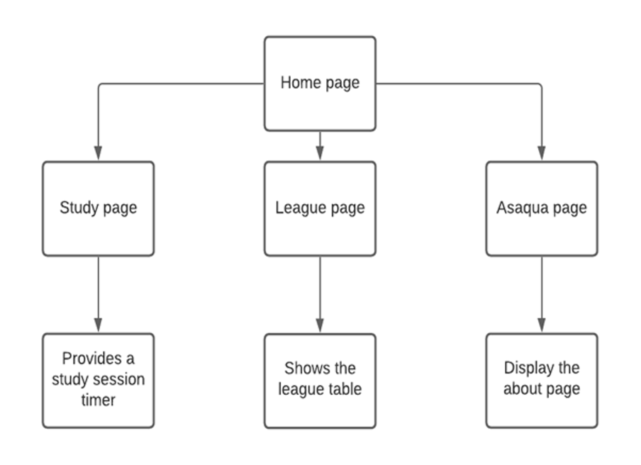

<b>
Figure 6: Application schema for the home page
</b>
 

Inside the home page we provide three sections that a user can access. These are the study page, league page, and Asaqua page.

 

#### Study page

Inside the study page, we provide an empty glass and a start/stop button. When the button is clicked, a study session is created. The timer starts and the glass will start filling up. We decided to set one study session to be 25 minutes. The flowchart for how the timer works is shown in Figure 7 below.

 

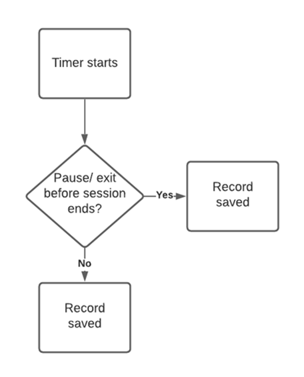

<b>
Figure 7: Study component timer
</b>

 

The word ‘record’ on the chart means the session details, such as when does the session happen, whether the session is finished or not, and how long was the user inside the session. The chart displayed above also shows that we save both finished and unfinished sessions to the database.

 

#### League

When the league page is accessed, we process the users data in our database (given the schema shown in the database section) to display each user's, and their friends’, total study time alongside their completed sessions for the week (from Monday to Sunday). Then, we sort and display the results based on who has completed the most sessions within the previous week. These results are displayed on a league table. The user's weekly progress is also displayed in a personal stats section. The associated designs are explained in the front-end system implementation.

Implementing the league table was more difficult than anticipated. We originally intended to use the RESTful API functions such as getFriendsUid() to get each user’s friends’ IDs which, would then allow us to use our getRecord() function, using the ids collected to form a league table. 

However, it became clear that this was a mistake after realising how messy and extremely inefficient the code was. After careful discussion, we decided to create a new route in the API and use a MongoDB query in this route. A get function in /api/league used the MongoDB query to return an array of the user’s friend records for a specified time period. Initially, the query returned only the user’s id with their study records. However, there were changes made later to replace the ids returned with names instead.

The changes made allowed for a single data service to be subscribed to. Unfortunately, the getLeague() function did not provide any information on the user’s score. Therefore, the league table currently does not include the user’s score.

 

## Class diagram

Shown below is the UML class diagram that demonstrates the production of UserData to be accessed by the front-end.

Facebook’s API returns a user object that is parsed into a chunk of Strings in the middle tier. This is then saved in the database according to the User schema. We have constructed it so that saved data can only be accessed by one variable per API call (in one API call it only returns userUID, or userName).

In terms of records, users can only post one record at a time but, will recieve all records within a short period of time. These records are then processed in the front-end to be shown in our league table.

 

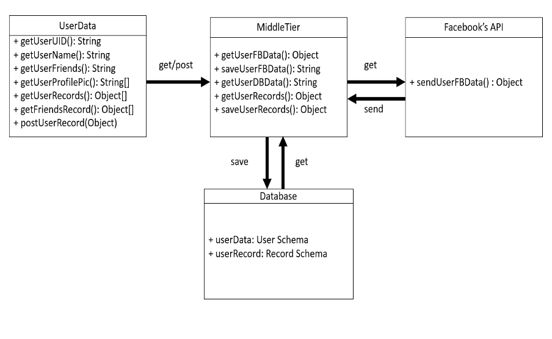

<b>
Figure 8: Class diagram 
</b>
 

## Sequence diagrams

 

The figure below represents how our application is used.

 

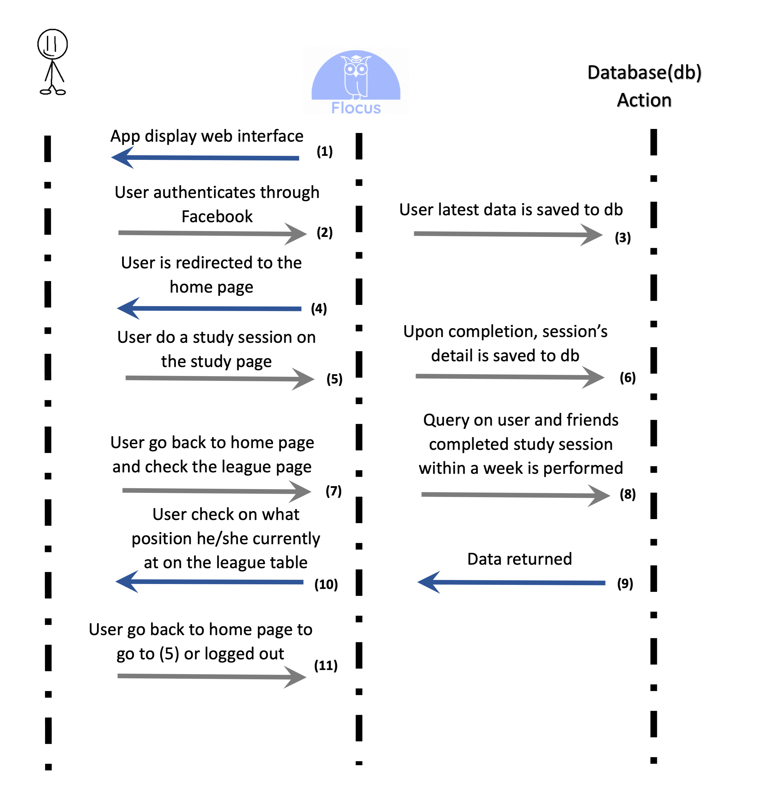

<b>
Figure 9: Sequential diagram for Flocus 
</b>
 

# Back End - MongoDB

## Database implementation

After the implementation of the authentication process, our backend developers had to create a separate collection, ‘Records’, in the database to persistently store study time records. Our application maintains the data of a study session recorded by the user, namely the timestamp and the time spent during a session. Each record also contains the user's Facebook UID as a primary key to identify the record owner. We then created a REST API that handles the GET and POST requests which, retrieve a summary of previous records and write new records to the database through calling the corresponding methods in an angular data service.

The backend developers decided to normalize the data storage, so the database separately stores the user’s information and usage data in two collections. Such an approach required fewer design decisions and is flexible when coping with unknown data storage demand. However, the drawback of this approach is that joining two collections becomes more complex to implement.

<b>
Figure 10: Entity relationship diagram of the two database collections
</b>

## Data model

The above entity-relationship diagram shows that our database has a normalized set-up despite using a NoSQL database service. When a user logs into our application, Facebook’s passport API returns the necessary information to our server. This allows us to save and update the data associated with the user within the User Collection. This ensures all data is up to date for when the user logs into Flocus next time. It is particularly important for the league feature to retrieve data of the user’s friends, who have potentially joined our application, or have been added as a new Facebook friend by the user since their initial sign-up.

As a team, we agreed to use the UID given by Facebook as the primary key between the two data collections. The Record collection holds the user's record log, which is generated when a user has completed a session or leaves the study component before their work session is over. Such a data model keeps as much user data as possible. Therefore, it allows for flexible data retrieval when fulfilling the demands of different components and offers the potential for future extensions. For example, you can flexibly alter the timespan in which you require data from, by specifying the desired time start and time end parameters. This offers the opportunity for future developers to extend the competition period or to easily add new components to the application. When our application needs data from both collections (aka a join query in a SQL model), we perform multi-staged queries to the database. The database then handles all the computationally complex sorting and searching functions which, reduces the computational burden on our server.

 

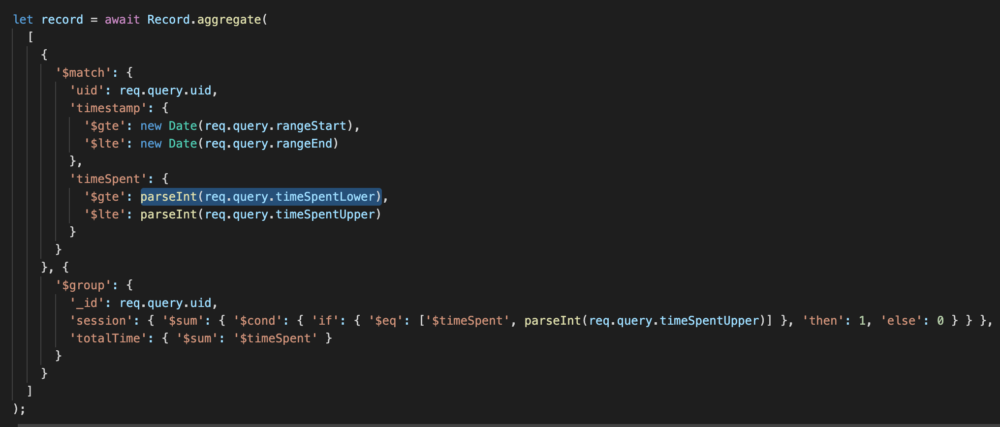

<b>
Figure 11: The record collection code snippet 
</b>

 

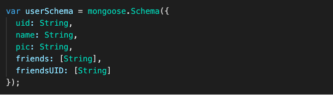

<b>
Figure 12: The user data model
</b>

 

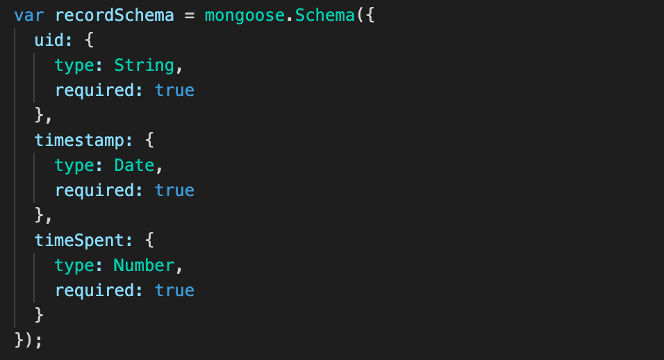

<b>
Figure 13: The record data model
</b>
 

# Middle Tier - Express, Node, the RESTful API

## Introduction

As discussed on the stack implementation section, the middle tier chosen for our application is NodeJS with the help of the ExpressJS framework. We utilised both NodeJS and ExpressJS to implement an API in our application. API stands for Application Programming Interface and its function is to allow our application to talk to other programmes such as Facebook or our database server.

On this project, RESTful architecture has been implemented on our API. RESTful stands for Representational State Transfer and in order to be called RESTful, an API needs to follow these 6 constraints:

- Client-Server Architecture 
- Stateless 
- Layered System 
- Cacheable 
- Uniform Design 
- Code on Demand 

Details of these constraints can be found here [link](https://restfulapi.net/rest-architectural-constraints/). 

In RESTful APIs, CRUD operations are used to manipulate and move data between applications. CRUD stands for Create, Read, Update, and Delete. We have used CRUD to communicate with our database and other applications. The HTTP methods to implement CRUD are: 

- GET – reading data  
- POST – creating data 
- PUT – updating data 
- DELETE – deleting data 

These HTTP methods are implemented in our server-side code which is in NodeJS and are combined with the functionality of ExpressJS which, makes doing HTTP requests, response, and routing much easier. An example of implementing API requests using ExpressJS is shown in Figure 14, while API requests without ExpressJS are shown in Figure 15 below. 

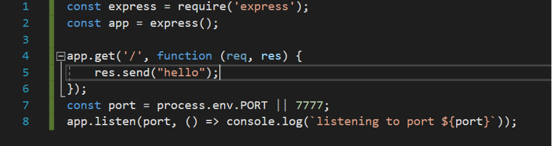

<b>
Figure 14: Implementation of API requests using ExpressJS
</b>

Without ExpressJS:

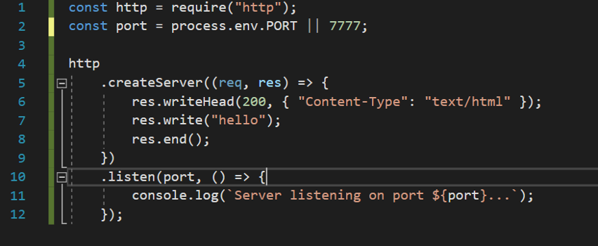

<b>
Figure 15: Implementation of API requests without using ExpressJS 
</b>

By comparing the two above figures, it is evident that by using ExpressJS our code is much more robust, simple, and easier to understand/read. Therefore, in our application we decided to implement RESTful API using ExpressJS.

Other than ExpressJS, we also used PassportJS to help with our Facebook authentication process.

## PassportJS

PassportJS is an authentication middleware for Node.js which, is compatible with any ExpressJS application. PassportJS provides strategies to assist authentication processes including but not limited to: 

-	Username and password
-	Facebook 
-	Google 
-	Twitter
-	Twitch 
-	Github 

Further information about what PassportJS is and what can be achieved with it can be found through the following [link](http://www.passportjs.org/). 

However, for our application, only be focused on PassportJS for authentication using Facebook. The complete documentation can be found here: [link](http://www.passportjs.org/docs/facebook/). In this section of the report, we will not dive into the documentation, but will instead discuss the hands-on experience of how we implemented PassportJS in Flocus.

To apply PassportJS, we will need to install three dependencies, which are; passport, passport-facebook, and express-session. Passport and passport-facebook are dependencies that are utilised to implement the functionality of authentication, while express-session is used to enhance connection security. As we are dealing with authentication and the transfer of user data, a secure connection was required. Beyond the installation, we also needed to use the dependencies as shown in the figures below.

 

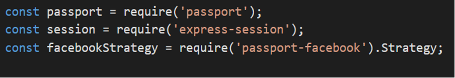

<b>
Figure 16: Dependencies 1
</b>

 

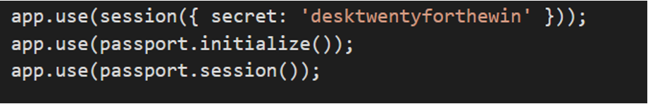

<b>
Figure 17: Dependencies 2
</b>
 

A further implementation of passport is shown in Figure 18. The skeleton of the code below was acquired from the PassportJS documentation and was then modified based on the needs of our application.

 

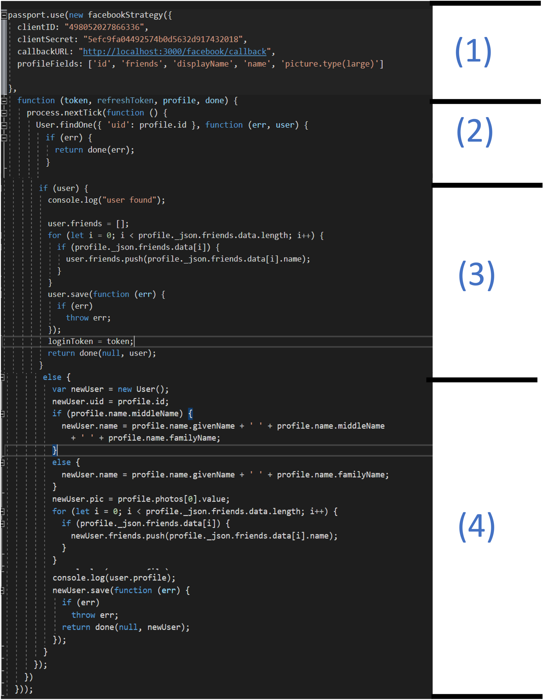

<b>
Figure 18: Implementation of PassportJS 
</b>

 

Code explanation by section number:

1.	This is the section where we help Facebook identify our application by supplying the clientID and clientSecret numbers. These numbers were acquired after we created an account and application on the Facebook for developers’ site. The callbackURL is a URL that we are redirected to after the authentication process is complete, i.e. when we press the submit button after entering our username and password. The URL could be anything we want (This will be detailed further in the later section of our report). The profile field is the where we input the type of data we want to acquire from the user’s Facebook account. For instance, in the code, you should be able to see that our application is requesting the user's id, friends, displayname, name, and profile picture. However, to acquire the requested data, we need to provide the correct permission. This will also be made clear in a later part of the report.

2.	This is the function that is called after the authentication process is successful. 'token' is the authentication token, 'refreshToken' will be the refreshToken, and the 'profile' will contain all user data that the user has agreed to provide (this process happens when the user clicks ‘continue’ on the pop-up shown in Figure 19). Following this, an internal search is conducted to check whether a user with the returned profile.id exists in our own database.

3.	If the user exists, the database is updated by emptying their friends’ array and filling the array with the latest friend’s data. The purpose is to check if there are any new friends joining the application.

4.	If the user does not exist, the user’s id, name, profile picture, and friends are saved to our own database. The Friends data that is returned by Facebook is not a complete list of all the user’s friends but just a list of friends who have also signed-up with our application.
 
The figure below shows the pop-up displayed to the test user:

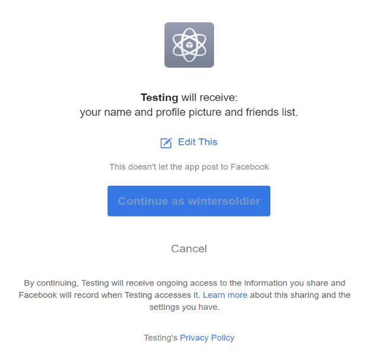

<b>
Figure 19: Test user pop-up
</b>
 

The figures below show the raw and json format inside the profile variable:

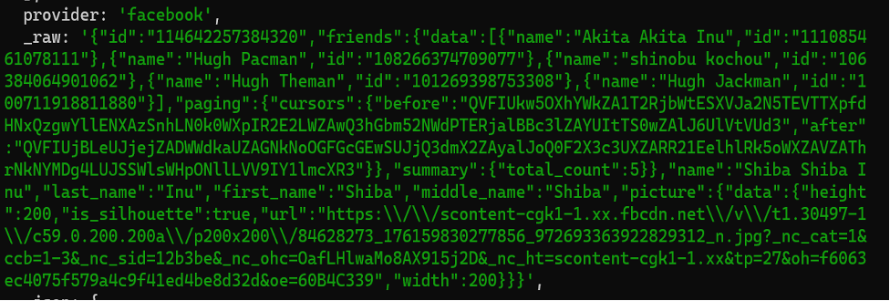

<b>
Figure 20: raw format
</b>

 

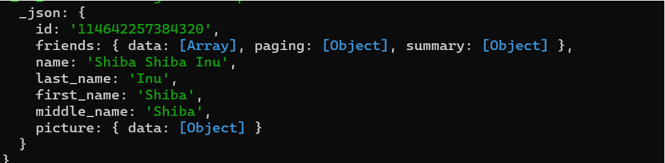

<b>
Figure 21: JSON format
</b>
 

To call the API (i.e., to be able to redirect the user to the Facebook login page), we were no table to use CRUD methods. We had to redirect a user via a link. The link name is our website name + “/auth/facebook”. Producing a GET API call (shown in Figure 22 below) did not redirect the user to the Facebook’s page. 

 

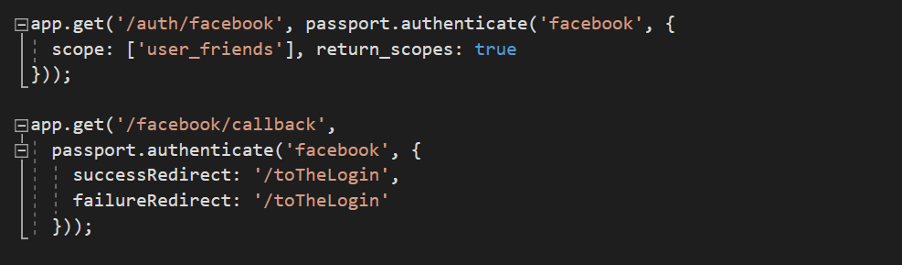

<b>
Figure 22: GET Facebook-API call 
</b>
 

The 'scope' is the most important to draw attention to as it includes the type of permission that we are going to use. The complete list of permission types on Facebook’s API can be found here(x). However, Flocus only uses the user_friends permission to get the user’s friends data. This means that all other data that is acquired by Flocus does not need any permission type to be acquired. It would only need the user’s permission, and this is provided when the user offers their approval on the pop-up message. Upon the success or failure of authentication, a GET request on “/facebook/callback” is called and both outcomes will redirect the user to GET “/toTheLogin” which is an API call to show us the index.html which, is our login page. The processes that occur after this have been discussed in the previos system implementation sections.

As discussed previously, PassportJS provides us with the isAuthenticated() method which checks if the user is logged in or not. The function is implemented inside another function in our application which is shown in Figure 23 below.

 

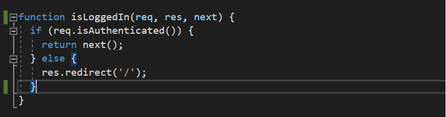

<b>
Figure 23: isloggedIn function
</b>

 

Furthermore, the function, isLoggedIn(),  is implemented in all other API calls in the application. So, an API call will only proceed if the user is logged in. If not, the user will be redirected back to the home screen. The API calls that are used to retrieve a user's data is shown in Figure 24 below.

 

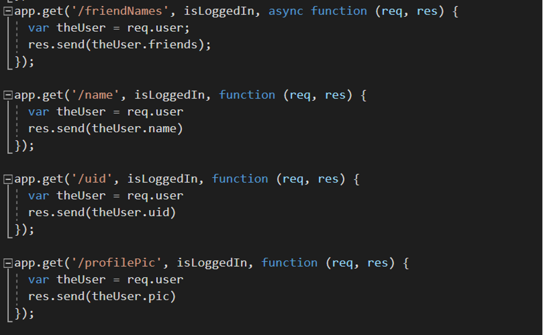

<b>
Figure 24: API get requests
</b>

 

Req.user contains the same data as the profile variable. Finally, another important function is the logout function which, is provided by PassportJS and is shown in Figure 25 below. Req.logout() will end the user session and redirect the user back to the login page.

 

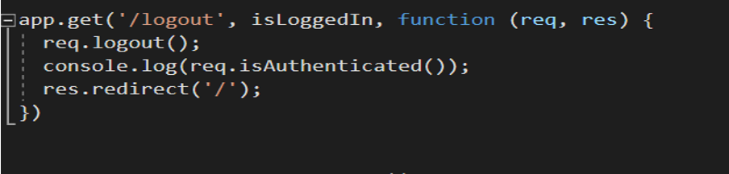

<b>
Figure 25: Logout function
</b>
 

## Records API

In this section, all API requests with relation to record data will be discussed. The first API request is a POST request which, takes a record object as its parameter. For this, the object must follow the record schema that was discussed on the database section. The POST request is shown in Figure 26 below.

 

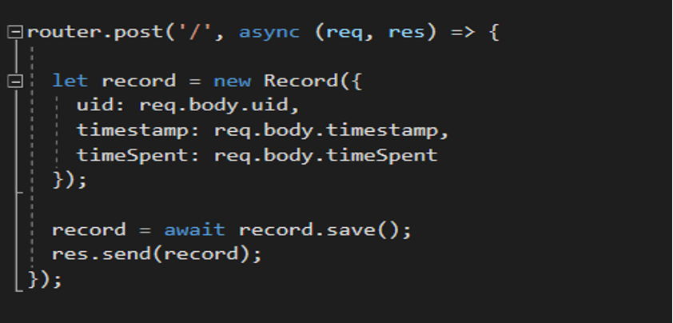

<b>
Figure 26: The POST request
</b>
 

So, each time a user completes, pauses or exits a session, a POST request is executed and a record object is saved in our database.

The next request is a GET request that takes a uid and a timespan as a parameter. Timespan meaning a starting date and an ending date. This GET method is utilised to get all records with the same uid and inside the time range specified on the parameter, from the database. Then all the record objects that is returned are directly going to be processed. The process is to sum all the timeSpent variable and session variable of all the returned records. Which at the end, the GET request will only return the total timeSpent and the total session of the user within the time range specified on the parameter. To achieve this, MongoDB smart query function calls aggregate is going to be used. The documentation on aggregate function could be found here https://docs.mongodb.com/manual/aggregation/. The GET method is shown below in Figure 27.

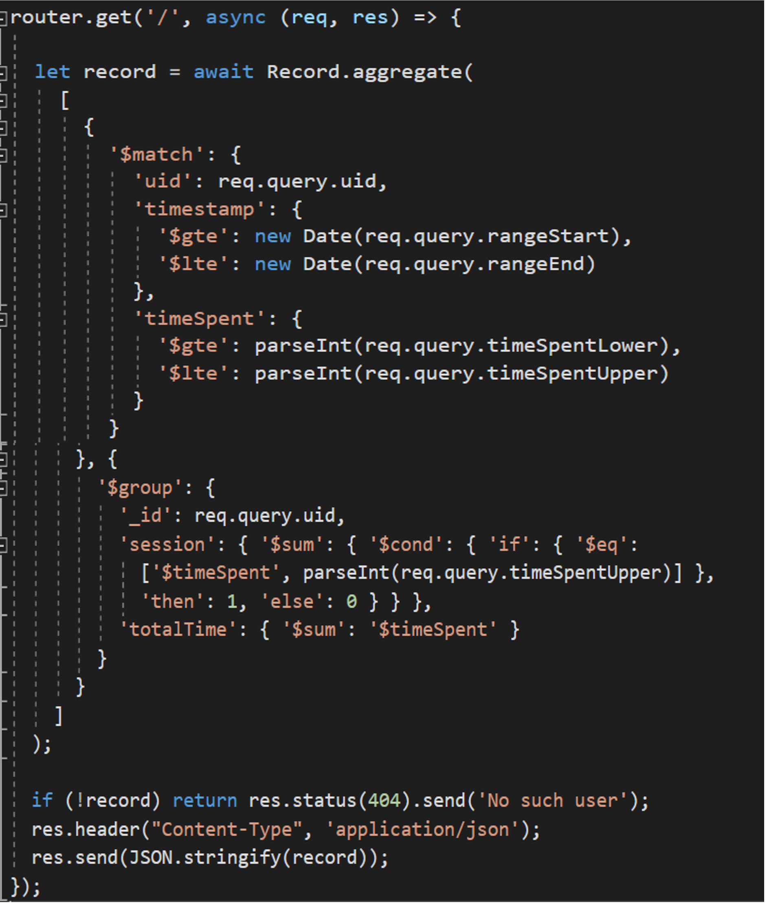

<b>
Figure 27: The GET method
</b>

## API for League Table

The last request is a GET request for the league table. It takes UID and a time range as its parameter. This reguest's first objective is to execute a search on the user database to find a user with the same UID as in the parameter. Then, the query accesses the friendsUID array and the friends array of the user. FriendsUID array of a user contains all the user friends’ UIDs.
We then search through our previous records, as in the GET request described above, for each of these UID's. Finally, the GET request will return three arrays:

1.	First array consists of: The user’s friends's names
2.	Second array consists of: Total number of sessions completed for each of the user’s friends
3.	Third array consists of: Total time spent studying for each of the user’s friends 

All returns are inside the time range specified in the parameter and all arrays are grouped (connected) before getting sorted in a descending order based on the number of sessions completed. By grouped we mean that if there is a change in position between elements inside one array, then the other two arrays will also experience the same change. As arrays are sorted in a descending order, the highest number of sessions completed will be on the top of the array (element 0) and the lowest will be on the bottom of the array.

# Front-End System Implementation

## Angular 

Angular offered a number of key advantages in the development of our Single Page Application. Primarily, the component-based structure facilitated efficient code maintenance and update (Decoupled components can be easily replaced with improved implementations). Additionally, during sprint sessions, team members would often work in parallel, accessing the same section of code. Angular enhanced this process by providing an easy-to-understand structure that improved readability. We had a brief discussion regarding Vue and React however, we remained with an Angular framework due to the familiarity of the group and course administrators with its setup. Additionally, our group was eager to utilise Lottie animations for front-end design and, from our preliminary research, Angular offers the easiest implementation of the <lottie-player>.

During our opening sprint, we set up all required components for the project, this is displayed below:

<b>
Figure 28: A screenshot of our Angular components
</b>

One of the primary objectives of Flocus is to provide a healthy and productive virtual space for students and experienced professionals to use for their studies. We realised the importance of being evidence-led when designing the front-end of our application and as such, conducted a brief literature overview to inform the design process of each component.

## Details of implementation

### Study component - design

The main component in Flocus is the study page where users spend a majority of their time. It was therefore critical for us, as the designers, to produce an environment that encourages productivity whilst minimising the risk of distraction. To achieve these outcomes, we investigated a growing body of research that points to the beneficial effects of nature on health, stress reduction and productivity. <a href="https://www.sciencedirect.com/science/article/abs/pii/S0272494415000328?via%3Dihub">Research from the University of Melbourne</a> has investigated the impact of exposure to natural scenes on response times, attention deficits and error frequency when conducting menial tasks. The findings offer statistically significant evidence of a negative, causal effect of natural environments on attention deficit and error frequency. Additionally, in an <a href="https://hbr.org/2015/09/gazing-at-nature-makes-you-more-productive">interview with the Havard Business Review</a>, Kate Lee, one of the lead researchers in this paper, claimed that the benefits of green micro-breaks can also be experienced through exposure via a screensaver. For those who are unable to gaze out of the window at a natural scene, we saw a clear issue which, we can provide a solution to. As a result, we decided to introduce a natural theme to the study component and, to align with the applications aim of raising awareness for water scarcity, we decided to use a blue colour scheme. This resulted in the following component design:

<b>
Figure 29: the front-end study component created using Figma
</b>

To further emulate a natural scene, CSS transformations were implemented on certain features of the component (e.g. clouds and birds) which, were designed so to avoid fast and distracting movements.  

The introduction of a clock or timer was discussed at length by the group. However, we decided to preclude this from the design as we did not want a traditional timer to distract from the theme and message of the overall component.

### Study component - functionality 

To introduce a glass fill animation, we used typescript which allows the user to start and stop the glass-fill as they please. The animation was implemented via the use of a SVG clip-path which is transformed vertically to reveal the underlying water animation. 

<b>
Figure 30: A screenshot of the HTML code used for the glass-fill animation
</b>

Upon completion of a study session (45 Minutes), the glass empties incrementally over the time allocated for a break.

The running tap affect was implemented by accessing a HTML DOM element object via a specified ID value. The animation iteration count was then toggled between 1 and infinite upon button click. This allowed the drip effect to sync with the glass fill whilst additionally completing the current iteration so to avoid sudden pauses. 

### Login component

The Login component is the initial design that greets users and as such, has been created to give an introduction to the theme of the site whilst offering a brief description of Flocus’s mission. To explore the avenue of serious play, we implemented a CSS hover animation on the login button and a Lottie animation.

<b>
Figure 31: A screenshot of welcome and login component in action 
</b>

### League table component

Tom Cockain, a developer of Flocus, provided the initial inspiration and idea of a league table that would further enhance user experience and reduce procrastination. To ensure that this approach was appropriate given our desired outcomes, we looked to the psychological field of study. Many contemporary studies have found a positive effect of competition on student course outcomes, motivation and effort. For example, <a href = "https://www.sciencedirect.com/science/article/abs/pii/S0360131510000527">(Burguillo, 2010)</a> found that the introduction of competition to the classroom increased final course performance. Additionally, research by <a href = "https://www.jneurosci.org/content/33/40/15894">(Le Bouc and Pessiglione, 2013)</a> and <a href = "https://journals.sagepub.com/doi/10.1177/1948550614539770">(Kilduff, 2014)</a> displayed a positive causal effect in student effort over the long- and short-term upon the introduction of a competitor. Despite the potentially positive outcome of increased competition, we were still concerned about individuals falling too far behind their peers and, as a result becoming de-motivated. Equally we were concerned about a minority pulling away with a clear margin of victory for long periods of time. To mitigate these risks, we decided to implement a 1-week competition duration. Additionally, a personal stats section was added to provide motivation for self-improvement. 

<b>
Figure 32: A screenshot of league table in action 
</b>

For the implementation of the personal stats section titled “Your Week”, we utilised Chartjs. To discourage overuse, we have included colour indicators that provide a subtle prompt to an individual if they are overworking - a bar that displays work over 9.75 hours will turn red. For this, we followed the UK governments advice on the 48-hour working limit and assumed that a student was studying for 5 days per week. The typescript code for the Chartjs bar-chart is attached below:

<b>
Figure 33: A code snippet of the typescript code used for the personal stats graph 
</b>

<b>
Figure 34: A code snippet of the typescript code used for the personal stats graph 
</b>

For the production of the League table, we wanted users to view all friends on Flocus and not just the top 10 performers. As such, we had to implement a dynamically resizing table that is initialised when the user first enters the league component. The typescript implementation of this below:

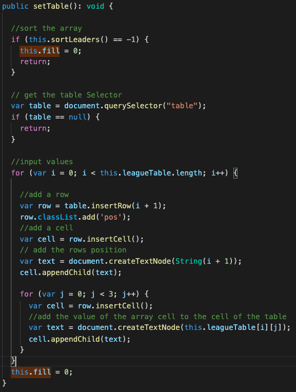

<b>
Figure 35: A code snippet of the typescript code used for the dynamically sized league table
</b>

The above typescript can be explained in the following steps:

<ol>
<li>Ensure that there are entries within the league array. If empty, do not proceed to create the table.</li>
<li>Sort all entries into descending order by number of glasses earnt.</li>
<li>Use the query selector to fetch the HTMLelement object that matches the CSS selector of ‘table’ and assign this object to a variable for further use.</li>
<li>Iterate through the leagueTable array, inserting a row and three cells into the table for each user.</li>
</ol>

To insert values into each cell of the table, we had to first create a text node and then append the cell with the .appendChild(String text) method.

However, once this was fully implemented, we found that our CSS animations were not applying correctly to their corresponding HTMLElements. After extensive research to resolve this matter, it turned out that we were experiencing a problem relating to Angular CSS encapsulation. By default, Angular uses encapsulation so that CSS styles in one component do not affect the rest of the application. This applies an attribute to all DOM elements in the encapsulated component and because we were dynamically inserting HTML, these attributes were not being added to some of our HTML elements. As we could not find a more sophisticated work-around, we had to remove encapsulation on the league table component. Obviously, this presents risks to the rest of the applications styling. However, we were careful to choose specific class names in our HTML league structure to mitigate issues in the future. This is something that needs to be addressed in a more sophisticated manner but, because of a lack of time, we were unable to implement this before the deadline.

### Asaqua component

In an endeavour to educate users about the great work that Asaqua has been achieving in Uganda, we included the asaqua component. We also wanted to ensure that users fully understand the Flocus project and how to use the site. This component was designed to be as simple as possible, although, we did manage to include Owl Pacino in the bottom right of the screen:

<b>
Figure 36: The Asaqua Component
</b>

### Homepage component

After speaking to prospective end-users in questionnaires, focus groups and informal interviews, we were made aware of the need to maintain a calm environment on the site, absent of stressful and fast-moving animations. As students ourselves, we fully understand the anxiety and tension that students and working professionals can be under during examination periods. As such, we did not want the study component to be the first thing that a user is confronted with when they complete the log-in process. We wanted to form an area in which users can decide, in their own time, when to proceed to the study component to begin their work. Additionally, from a design perspective, a home component facilitates easy navigation whilst removing the need for a permanent nav-bar and allowing front-end developers to use the full size of the screen to implement eye-pleasing animations. However, the front-end design of this component was a difficult one to achieve. We wanted to use calming animations without increasing the risk of distraction and thus compromising on our main objective of reducing procrastination. 

We have attached a screenshot of the home component below, although to get a clearer view of the animation please visit our demo video.

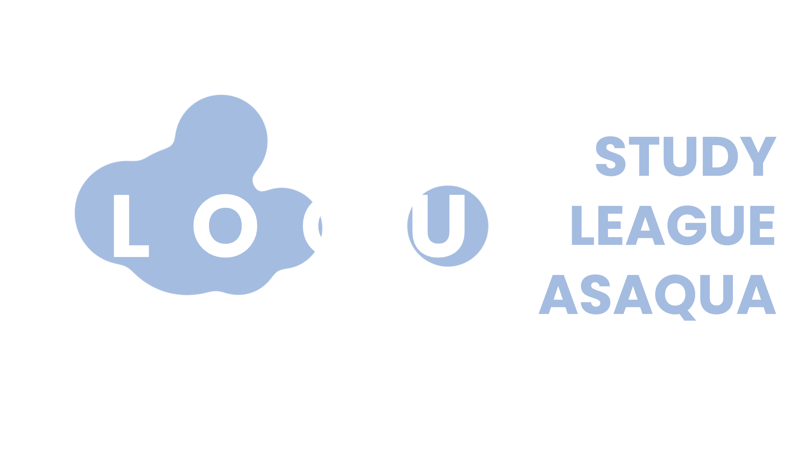

<b>
Figure 37: The Home Component
</b>

To achieve this animation, we created six Scalable Vector Graphics (SVG) circle elements and implemented CSS keyframe animations on three of them. To implement the liquid effect of waterdrops merging, we utilised the FeGaussianBlur and FeColorMatrix to specify the filter. This filter was then used with the FeBlend which merges SVG elements. In effect, this is similar to introducing a blur effect on an SVG and then increasing the contrast.  The HTML for this is displayed in the code snippet below:

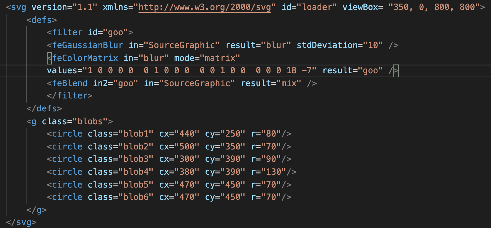

<b>
Figure 38: A code snippet from the Home Component's main animation
</b>

We have placed the nav-bar on the right-hand side and have implemented CSS state changes on hover. 

# Additional Elements and Components

## Front-end

### Lottie animations

Lottie is an open-source animation file format that allows creators to easily convert Adobe After-Affects animations for implementation in HTML code. For Flocus, it allowed us to display lightweight, scalable and interactive animations that enhanced the serious play aspect of our application. Initially, we began creating custom made animations for the application in AAE, converting to JSON files via the BodyMovin’ extension. However, this process was far more challenging than initially expected – Lottie files do not currently support certain mattes and effects that make animating in AAE achievable in short periods of time. As a result, we utilised the large and comprehensive Lottie file library where a large number of creators have made their work freely available.

<b>
Figure 39: A snippet of the lottie-player bringing animation to life 
</b>

The Lottie-player is a Web-Component for easily including and playing Lottie animations. It was the fastest implementation of Lottie, allowing us to specify certain parameters such as speed and iteration count. However, it is not absent of drawbacks. From our individual use and user feedback, it was made aware that certain browser would not render or handle the animations as desired. The browser that displayed the most issues was Safari. In an attempt to work around this glitch, we rendered the animation on a canvas rather than SVG. However, Lottie animations do not currently support certain animation effects on canvas and so when rendering, the Lottie animation became distorted and un-useable. Given the lack of sufficient time to address these concerns, we had to accept that the application was not going to operate as well in Safari as other browsers (e.g Chrome). We have passed this information to the Asaqua team for future adjustment. 

The relevant licence information regarding free-for-use Lottie animations is stated below:

“All the public files available in LottieFiles are distributed under Creative Commons (CC) Attribution (BY) unless stated otherwise. This license allows reusers to distribute, remix, adapt, and build upon the material in any medium or format, so long as attribution is given to the creator. The license allows for commercial use.” (https://lottiefiles.com/page/license)

All files in use by Flocus have been distributed under the Creative Commons license and Asaqua have been informed of the requirement to provide credit to the original creators upon commercial rollout.

URLs for Lottie animations in use:
- winning.json; https://lottiefiles.com/42226-winning-leadership
- Login-guy.json; https://lottiefiles.com/36707-working-man

### Adobe Stock

Unfortunately, Flocus’s development budget did not stretch far enough to cover the subscription or the early cancelation fees of Adobe Photoshop or Illustrator. Luckily however, with the use of a 30-day free trial, a member of the team accessed Adobe Stock, a platform where third-party designs can be fully licensed for commercial use. As such, the Study component has been designed from an illustration licensed under the perpetual and worldwide Adobe licence:

“An Adobe Stock perpetual, worldwide licence allows you to use your licensed asset in all media including print, presentations, broadcasts, websites, and on social media sites.” Additionally, a standard licence allows for the modification of a design. 

We first converted the .ai file to a .svg format for edit in Figma. We then isolated each layer for CSS animations and user interaction. The layering was achieved with the use of the z-index in CSS. 

Adobe licence information: https://stock.adobe.com/uk/license-terms

Original design: https://stock.adobe.com/uk/images/clean-water-vector-illustration-tiny-drinking-fresh-potable-person-concept/269962379

# Deployment Details

## GitHub

A GitHub repository for the team allowed for a continuous integration of new features for the application. Each developer in the team was able to commit or fetch new changes to and from main and merge these changes to their own branch.

## Docker

It was important during the development of our application to have a consistent environment for deployment, particularly as there was a split between MacOS and Windows in the team. 

An open source tool called Docker was used to create a consistent runtime environment which the team could use to deploy our application for testing.

A Dockerfile and docker-compose.yml file were placed in the dashboard directory. This was collectively used by the team to deploy the application with the set environment variables.

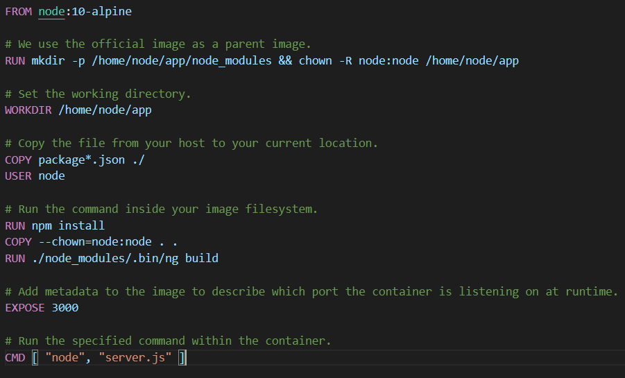

<b>
Figure 40: The Dockerfile used 
</b>

The dockerfile contains commands used to create a specific image of our application and each image created using the dockerfile was stored for later access. This helped achieve continuous integration of our code. Any changes in code could easily be reverted by using an old image.

The docker-compose.yml file was used for defining and running two Docker containers. One container for Node and a second for our database, MongoDB. A wait script was used to ensure the database container was built before Node to prevent Node from attempting to connect to the database before it was built. The two containers are set up from the docker-compose file to communicate over a simple port protocol.   

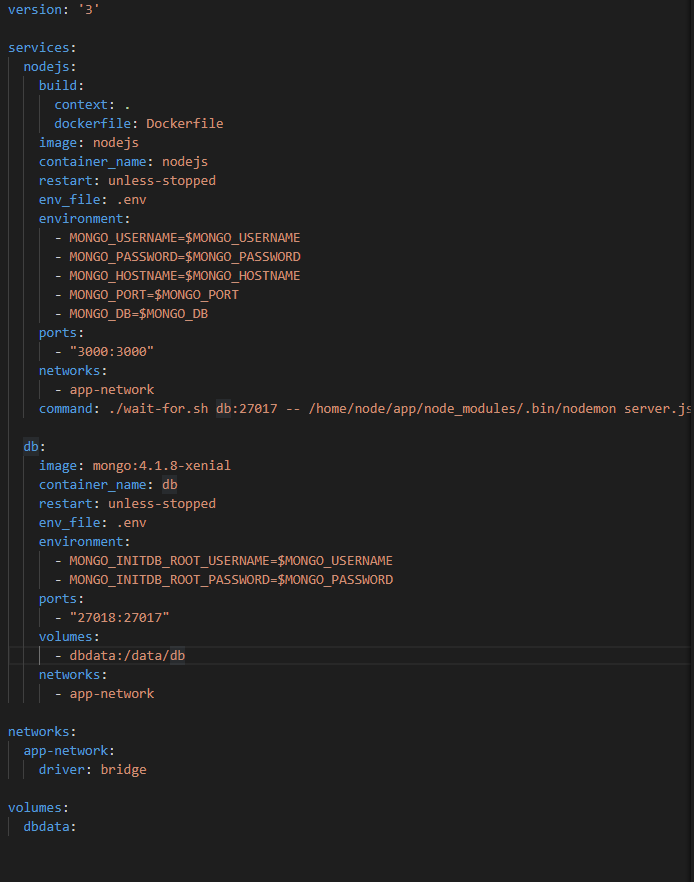

<b>
Figure 41: The Docker-compose file used 
</b>

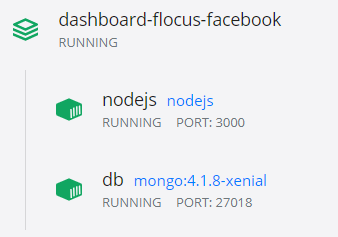

<b>
Figure 42: Docker running both Node and MongoDB 
</b>

As new changes to the application were made, the two containers were rebuilt using the command ‘docker-compose pull’ and ‘docker-compose build nodejs’. The integration of new code could then be tested thoroughly by running the containers with the desired environment.

The consistent deployment environment managed by Docker enabled the team to robustly integrate new features into the application. Additionally, the Dockerfile could be changed in the future to test the application on different platforms. This would greatly simplify shipping the application to any hosting provider.

# Project report navigation

- [Next page: UX Design](https://github.com/STF1998/Desk20/blob/main/report/UXDesign.md)
- [Previous page: Background and Motivation](https://github.com/STF1998/Desk20/blob/main/report/backgroundAndMotivation.md)
- [Go back to Homepage](https://github.com/STF1998/Desk20)
