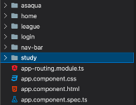
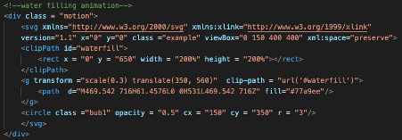
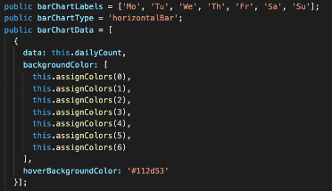

# System Implementation [20%]

## Contents of System Implementation

- [**Stack architecture and system design**](#Stack-architecture-and-system-design)
  - [Class diagrams](#Class-diagrams)
  - [Sequence diagrams](#Sequence-diagrams)
- [**Back End - MongoDB**](#Back-End---MongoDB)
  - [Database implementation](#Database-implementation)
  - [Data model](#Data-model)
- [**Middle Tier**](#Middle-Tier)
  - [Express](#Express)
  - [Node](#Node)
  - [The RESTful API](#The-RESTful-API)
- [**Front End**](#Front-End)
  - [Angular](#Angular)
  - [Details of implementation](#Details-of-implementation)
- [**Additional Elements and Components**](#Additional-elements-and-components)
- [**Deployment Details**](#Deployment-Details)

# Stack architecture and system design

## Class diagrams

## Sequence diagrams

# Back End - MongoDB

The first objective of the back end (middleware) developers was to be able to authenticate a user coming into our application using the Facebook API. At the same time, creating an API request to get the user data and store the data in our database. The data taken from Facebook is the user’s name, Facebook UID, profile picture, and a list of friends who are or have been using the application. 

To help us achieve the objective, we utilised PassportJS. PassportJS is a comprehensive set of strategies that supports authentication using username and password, Facebook, Twitter etc. The steps shown in the PassportJS documentation on authentication through Facebook [x] were then followed, the steps include:
1.	Installing the packages required by PassportJS
2.	Create an application at Facebook Devs (Facebook for Developers)
3.	Assigning the unique application ID and application secret acquired from Facebook Devs site to the code which is provided in PassportJS documentation
4.	Modify the skeleton code provided in the documentation to be able to function as needed

Then, the second objective would be to create a get requests that could return a specific data wanted by the front-end developers. For instance, as shown in Figure 1 and Figure 2.

<b>
Figure 1: GET request to get each of the user's friends UID
</b>

<b>
Figure 2: GET request to get each of the user's friends name
</b>

## Database implementation

## Data model

# Middle Tier

## Express

## Node

## The Restful-API

# Front-End System Implementation

## Angular 

Angular offered a number of key advantages in the development of our Single Page Application. Primarily, the component-based structure facilitated efficient code maintenance and update (Decoupled components can be easily replaced with improved implementations). Additionally, during sprint sessions, team members would often work in parallel, accessing the same section of code. Angular enhanced this process by providing an easy-to-understand structure that improved readability. We had a brief discussion regarding Vue and React however, we remained with an Angular framework due to the familiarity of the group and course administrators with its setup. Additionally, our group was eager to utilise Lottie animations for front-end design and, from our preliminary research, Angular offers the easiest implementation of the <lottie-player>.

During our opening sprint, we set up all required components for the project, this is displayed below:

<b>
Figure : A screenshot of the single page application components.
</b>

One of the primary objectives of Flocus is to provide a healthy and productive virtual space for students and experienced professionals to use for their studies. We realised the importance of being evidence-led when designing the front-end of our application and as such, conducted a brief literature overview to inform the design process of each component.

## Details of implementation

### Study component - design 

The main component in Flocus is the study page where users spend a majority of their time. It was therefore critical for us, as the designers, to produce an environment that encourages productivity whilst minimising the risk of distraction. To achieve these outcomes, we investigated a growing body of research that points to the beneficial effects of nature on health, stress reduction and productivity. Research from the University of Melbourne investigated the impact of exposure to natural scenes on response times, attention deficits and error frequency when conducting menial tasks. The findings offered statistically significant evidence of a negative, causal effect of natural environments on attention deficit and error frequency. Although the effect with the largest magnitude came from immersion in a natural environment, exposure via a screensaver also offered statistically significant results. () Other papers that offer similarly robust evidence include ()()(). As a result, we decided to introduce a natural theme to the study component and, to align with the applications aim of raising awareness for water scarcity, we decided to use a blue colour scheme. This resulted in the following component design:

<b>
Figure : the front-end animation created using Adobe after-effects and lottie files. 
</b>

To further emulate a natural scene, CSS transformations were implemented on certain features of the component (e.g. clouds and birds) which, were designed so to avoid fast and distracting movements.  

The introduction of a clock or timer was discussed at length by the group. However, we decided to preclude this from the design as we did not want a traditional timer to distract from the theme and message of the overall component.

### Study component - functionality 

To introduce a glass fill animation, we used typescript which allows the user to start and stop the glass-fill as they please. The animation was implemented via the use of a SVG clip-path which is transformed vertically to reveal the underlying water animation. 

<b>
Figure : A screenshot of the code used to convert the animation into HTML format.
</b>

Upon completion of a study session (45 Minutes), the glass empties incrementally over the time allocated for a break.

The running tap affect was implemented by accessing a HTML DOM element object via a specified ID value. The animation iteration count was then toggled between 1 and infinite upon button click. This allowed the drip effect to sync with the glass fill whilst additionally completing the current iteration so to avoid sudden pauses. 

### Login component

The Login component is the initial design that greets users and as such, has been created to give an introduction to the theme of the site whilst offering a brief description of Flocus’s mission. To explore the avenue of serious play, we implemented a CSS hover animation on the login button and a Lottie animation.

<b>
Figure : A screenshot of welcome and login component in action. 
</b>

### League table component

Tom Cockain, a developer of Flocus, provided the initial inspiration and idea of a league table that would further enhance user experience and reduce procrastination. To ensure that this approach was appropriate given our desired outcomes, we looked to the psychological field of study. Many contemporary studies have found a positive effect of competition on student course outcomes, motivation and effort. For example, (Burguillo, 2010) found that the introduction of competition to the classroom increased final course performance. Additionally, research by (Le Bouc and Pessiglione, 2013) and (Kilduff, 2014) displayed a positive causal effect in student effort over the long- and short-term upon the introduction of a competitor. Despite the potentially positive outcome of increased competition, we were still concerned about individuals falling too far behind their peers and, as a result becoming de-motivated. Equally we were concerned about a minority pulling away with a clear margin of victory for long periods of time. To mitigate these risks, we decided to implement a 1-week competition duration. Additionally, a personal stats section was added to provide motivation for self-improvement. 

<b>
Figure : A screenshot of league table in action. 
</b>

For the implementation of the personal stats section titled “Your Week”, we utilised Chartjs. To discourage overuse, we have included colour indicators that provide a subtle prompt to an individual if they are overworking - a bar that displays work over 9.75 hours will turn red. For this, we followed the UK governments advice on the 48-hour working limit and assumed that a student was studying for 5 days per week. The typescript code for the Chartjs bar-chart is attached below:

<b>
Figure : A code snippet of the typescript code used for the league table. 
</b>

TODO - Resizing HTML League table: (Include when developed).

### Asaqua component

TODO 
- Why did we need?
-What approach to design did you take?
- Asaqua will be taking the page forward as a useful source of publicity and possibly a source of revenue through ads. 
-Link to Asaqua page was included. 

### Homepage component

# Additional Elements and Components

## Lottie animations

TODO

# Deployment Details

