# System Implementation [20%]

## Contents of System Implementation

- [**Stack architecture and system design**](#Stack-architecture-and-system-design)
  - [Class diagrams](#Class-diagrams)
  - [Sequence diagrams](#Sequence-diagrams)
- [**Back End - MongoDB**](#Back-End---MongoDB)
  - [Database implementation](#Database-implementation)
  - [Data model](#Data-model)
- [**Middle Tier**](#Middle-Tier)
  - [Express](#Express)
  - [Node](#Node)
  - [The RESTful API](#The-RESTful-API)
- [**Front End**](#Front-End)
  - [Angular](#Angular)
  - [Details of implementation](#Details-of-implementation)
- [**Additional Elements and Components**](#Additional-elements-and-components)
- [**Deployment Details**](#Deployment-Details)

# Stack architecture and system design

Our team decided to use MEAN stack for developing this project. MEAN stands for MongoDB, Express, Angular, and Node.js. Even though the stack consists of multiple technologies, all of them are based on one coding language, which is JavaScript. The roles of each technology are:

-	MongoDB: database solution
-	Express: NodeJS framework to simplify http request and response
-	Angular: Front-end browser-side framework
-	Node.js: Runtime server-side code

Below is a diagram on how the each of the technologies interacts with one another within the stack.

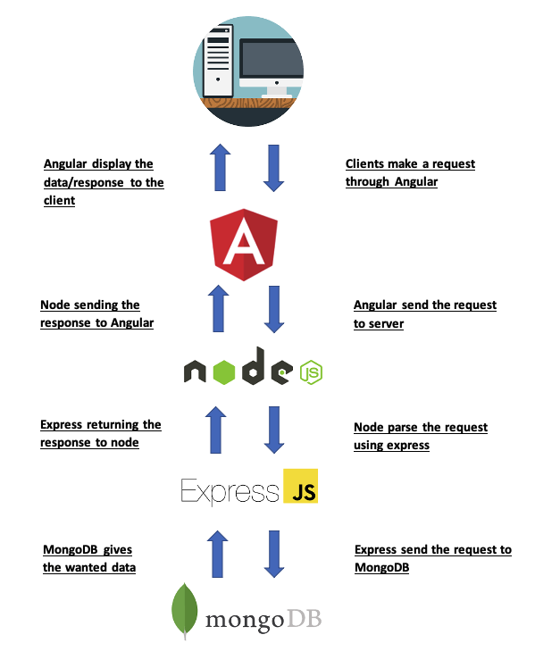

<b>
Figure 1: Stack diagram.
</b>

MEAN stack was chosen due to its advantages, including:
-	It has a large and helpful online community. There are several tutorials, lectures, and problem-solving articles or videos about MEAN stack on the web. 
-	Single programming language – this helps to create an easy working environment for full stack development.
-	Supports automated testing – ensures readily available quality checks.
-	Isomorphic coding – allows developers to switch to another framework without altering much of the original code.
-	Support from the faculty, as the lectures and support provided was focused on MEAN stack.

As a ateam we also did a bit of research on different stacks, including MEVN and MERN:

<table>
<tr>
  <th>MEVN</th>
  <th>MERN</th>
</tr>
<tr>
  <td>
    <ul>
      <li> MongoDB </li>
      <li> Express </li>
      <li> Vue </li>
      <li> Node.js </li>
    </ul>
  </td>
  <td>
    <ul>
      <li> MongoDB </li>
      <li> Express </li>
      <li> React </li>
      <li> Node.js</li>
    </ul>
  </td>
</table>

The only difference between these stacks is the front-end framework. For this project, Angular was selected. In terms of the front-end, Sam and Hugh have really enjoyed developing a strong understanding of how the front-end works. Angular has defintely ensured we have a strong grasp of various areas, including typescript.

According to the GitHub stars received on each of the front-end framework (Angular, React, Vue), Angular is the least popular one and it is shown in the graph below [link](https://www.codeinwp.com/blog/angular-vs-vue-vs-react/). 

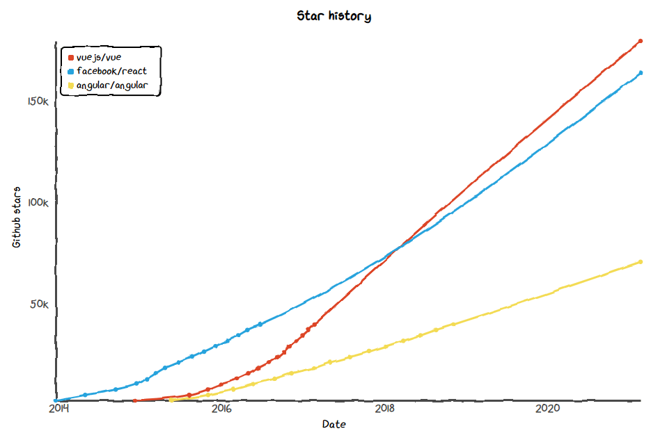

<b>
Firgure 2: Number of stars on GitHub projects for Angular, React, and Vue
</b>

## Class diagrams

## Sequence diagrams

# Back End - MongoDB

The first objective of the back end (middleware) developers was to be able to authenticate a user coming into our application using the Facebook API. At the same time, creating an API request to get the user data and store the data in our database. The data taken from Facebook is the user’s name, Facebook UID, profile picture, and a list of friends who are or have been using the application. 

To help us achieve the objective, we utilised PassportJS. PassportJS is a comprehensive set of strategies that supports authentication using username and password, Facebook, Twitter etc. The steps shown in the PassportJS documentation on authentication through Facebook [x] were then followed, the steps include:
1.	Installing the packages required by PassportJS
2.	Create an application at Facebook Devs (Facebook for Developers)
3.	Assigning the unique application ID and application secret acquired from Facebook Devs site to the code which is provided in PassportJS documentation
4.	Modify the skeleton code provided in the documentation to be able to function as needed

Then, the second objective would be to create a get requests that could return a specific data wanted by the front-end developers. For instance, as shown in Figure 1 and Figure 2.

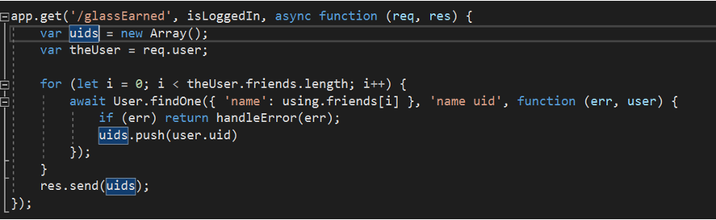

<b>
Figure 1: GET request to get each of the user's friends UID
</b>

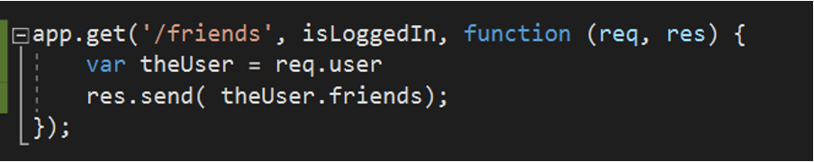

<b>
Figure 2: GET request to get each of the user's friends name
</b>

## Database implementation

## Data model

# Middle Tier

## Express

## Node

## The Restful-API

# Front-End System Implementation

## Angular 

Angular offered a number of key advantages in the development of our Single Page Application. Primarily, the component-based structure facilitated efficient code maintenance and update (Decoupled components can be easily replaced with improved implementations). Additionally, during sprint sessions, team members would often work in parallel, accessing the same section of code. Angular enhanced this process by providing an easy-to-understand structure that improved readability. We had a brief discussion regarding Vue and React however, we remained with an Angular framework due to the familiarity of the group and course administrators with its setup. Additionally, our group was eager to utilise Lottie animations for front-end design and, from our preliminary research, Angular offers the easiest implementation of the <lottie-player>.

During our opening sprint, we set up all required components for the project, this is displayed below:

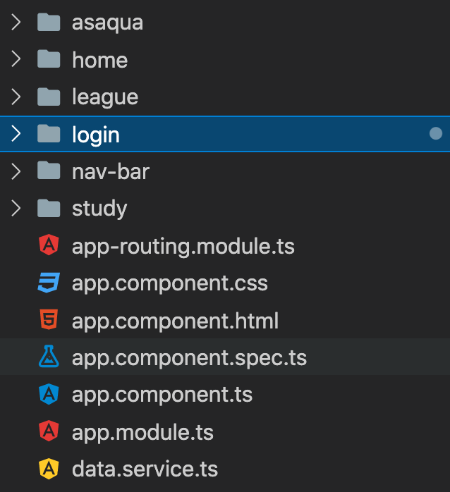

<b>
Figure : A screenshot of the single page application components.
</b>

One of the primary objectives of Flocus is to provide a healthy and productive virtual space for students and experienced professionals to use for their studies. We realised the importance of being evidence-led when designing the front-end of our application and as such, conducted a brief literature overview to inform the design process of each component.

## Details of implementation

### Study component - design

The main component in Flocus is the study page where users spend a majority of their time. It was therefore critical for us, as the designers, to produce an environment that encourages productivity whilst minimising the risk of distraction. To achieve these outcomes, we investigated a growing body of research that points to the beneficial effects of nature on health, stress reduction and productivity. Research from the University of Melbourne investigated the impact of exposure to natural scenes on response times, attention deficits and error frequency when conducting menial tasks. The findings offered statistically significant evidence of a negative, causal effect of natural environments on attention deficit and error frequency. Although the effect with the largest magnitude came from immersion in a natural environment, exposure via a screensaver also offered statistically significant results. () Other papers that offer similarly robust evidence include ()()(). As a result, we decided to introduce a natural theme to the study component and, to align with the applications aim of raising awareness for water scarcity, we decided to use a blue colour scheme. This resulted in the following component design:

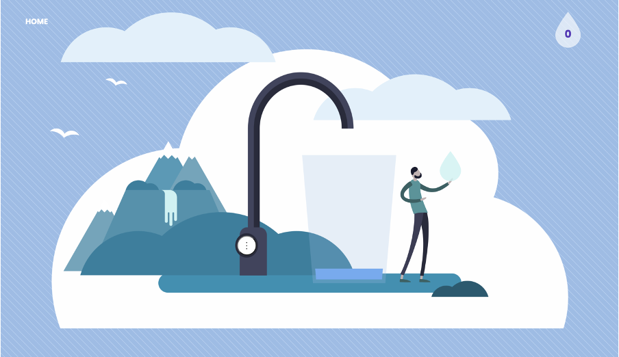

<b>
Figure : the front-end study component created using Figma
</b>

To further emulate a natural scene, CSS transformations were implemented on certain features of the component (e.g. clouds and birds) which, were designed so to avoid fast and distracting movements.  

The introduction of a clock or timer was discussed at length by the group. However, we decided to preclude this from the design as we did not want a traditional timer to distract from the theme and message of the overall component.

### Study component - functionality 

To introduce a glass fill animation, we used typescript which allows the user to start and stop the glass-fill as they please. The animation was implemented via the use of a SVG clip-path which is transformed vertically to reveal the underlying water animation. 

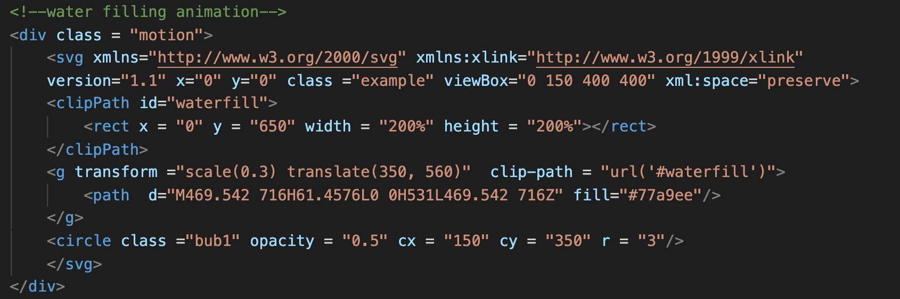

<b>
Figure : A screenshot of the HTML code used for the glass-fill animation.
</b>

Upon completion of a study session (45 Minutes), the glass empties incrementally over the time allocated for a break.

The running tap affect was implemented by accessing a HTML DOM element object via a specified ID value. The animation iteration count was then toggled between 1 and infinite upon button click. This allowed the drip effect to sync with the glass fill whilst additionally completing the current iteration so to avoid sudden pauses. 

### Login component

The Login component is the initial design that greets users and as such, has been created to give an introduction to the theme of the site whilst offering a brief description of Flocus’s mission. To explore the avenue of serious play, we implemented a CSS hover animation on the login button and a Lottie animation.

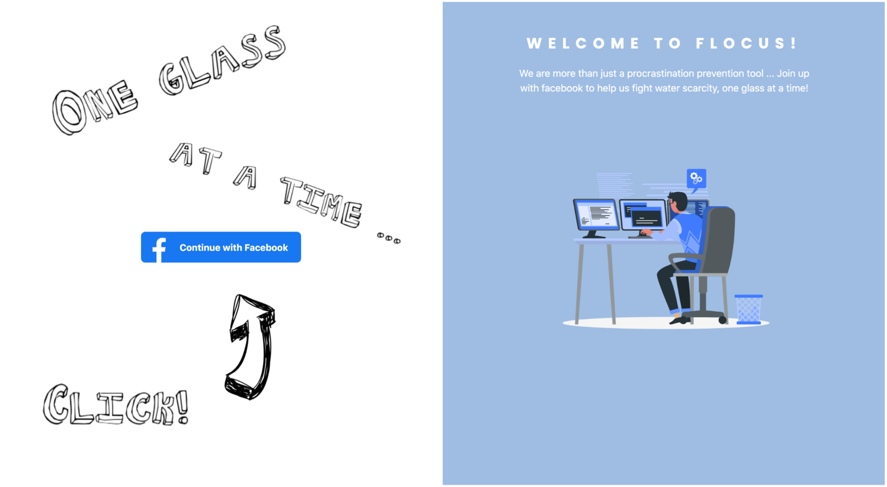

<b>
Figure : A screenshot of welcome and login component in action. 
</b>

### League table component

Tom Cockain, a developer of Flocus, provided the initial inspiration and idea of a league table that would further enhance user experience and reduce procrastination. To ensure that this approach was appropriate given our desired outcomes, we looked to the psychological field of study. Many contemporary studies have found a positive effect of competition on student course outcomes, motivation and effort. For example, (Burguillo, 2010) found that the introduction of competition to the classroom increased final course performance. Additionally, research by (Le Bouc and Pessiglione, 2013) and (Kilduff, 2014) displayed a positive causal effect in student effort over the long- and short-term upon the introduction of a competitor. Despite the potentially positive outcome of increased competition, we were still concerned about individuals falling too far behind their peers and, as a result becoming de-motivated. Equally we were concerned about a minority pulling away with a clear margin of victory for long periods of time. To mitigate these risks, we decided to implement a 1-week competition duration. Additionally, a personal stats section was added to provide motivation for self-improvement. 

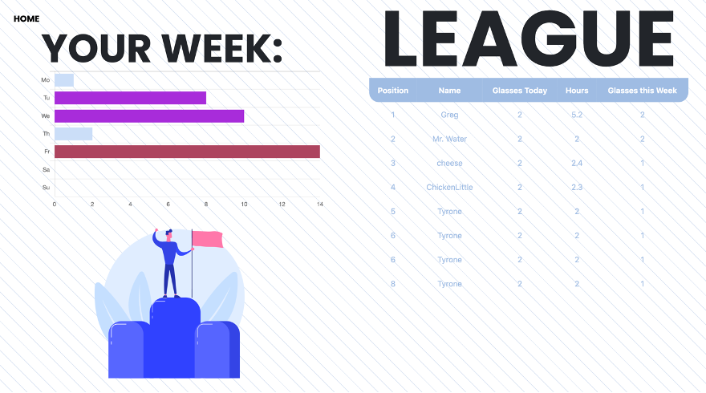

<b>
Figure : A screenshot of league table in action. 
</b>

For the implementation of the personal stats section titled “Your Week”, we utilised Chartjs. To discourage overuse, we have included colour indicators that provide a subtle prompt to an individual if they are overworking - a bar that displays work over 9.75 hours will turn red. For this, we followed the UK governments advice on the 48-hour working limit and assumed that a student was studying for 5 days per week. The typescript code for the Chartjs bar-chart is attached below:

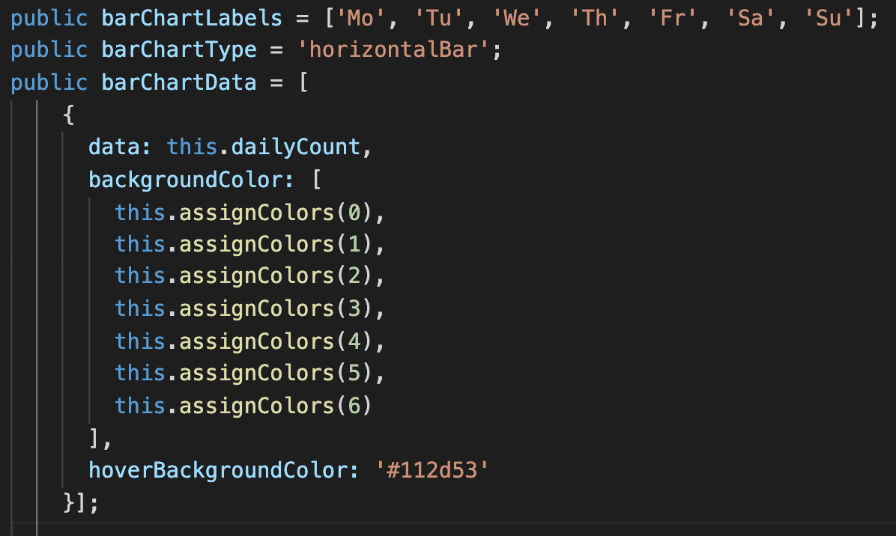

<b>
Figure : A code snippet of the typescript code used for the personal stats graph. 
</b>

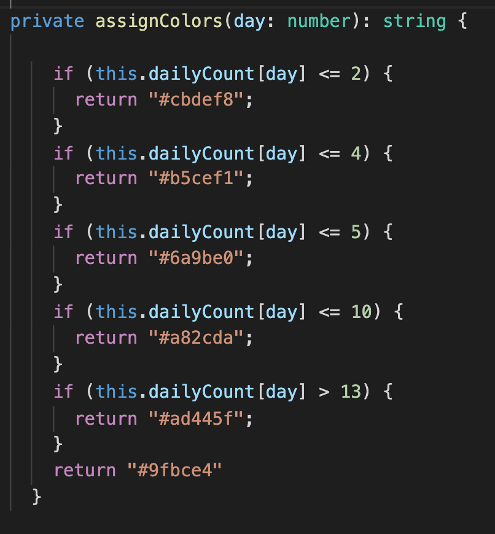

<b>
Figure : A code snippet of the typescript code used for the personal stats graph. 
</b>

TODO - Resizing HTML League table: (Include when developed).

### Asaqua component

In an endeavour to educate users of the great work that Asaqua has been achieving in Uganda, we included the study component. We also wanted to ensure that users fully understand the Flocus project and how to use the site. We wanted to make this component as simple as possible from a design perspective, although, we did manage to include Owl Pacino in the bottom right of the screen:

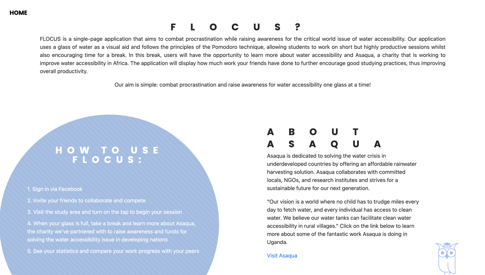

<b>
Figure : The Asaqua Component
</b>

### Homepage component

# Additional Elements and Components

## Front-end

### Lottie animations

Lottie is an open-source animation file format that allows creators to easily convert Adobe After-Affects animations for implementation in HTML code. For Flocus, it allowed us to display lightweight, scalable and interactive animations that enhanced the serious play aspect of our application. Initially, we began creating custom made animations for the application in AAE, converting to JSON files via the BodyMovin’ extension. However, this process was far more challenging than initially expected – Lottie files do not currently support certain mattes and effects that make animating in AAE achievable in short periods of time. As a result, we utilised the large and comprehensive Lottie file library where a large number of creators have made their work freely available.

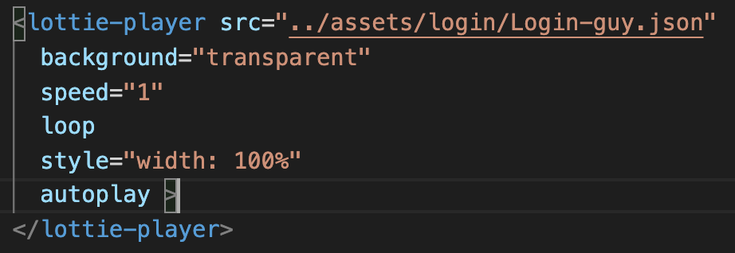

<b>
Figure : A snippet of the lottie-player bringing animation to life. 
</b>

The Lottie-player is a Web-Component for easily including and playing Lottie animations. It was the fastest implementation of Lottie, allowing us to specify certain parameters such as speed and iteration count. However, it is not absent of drawbacks. From our individual use and user feedback, it was made aware that certain browser would not render or handle the animations as desired. The browser that displayed the most issues was Safari. In an attempt to work around this glitch, we rendered the animation on a canvas rather than SVG. However, Lottie animations do not currently support certain animation effects on canvas and so when rendering, the Lottie animation became distorted and un-useable. Given the lack of sufficient time to address these concerns, we had to accept that the application was not going to operate as well in Safari as other browsers (e.g Chrome). We have passed this information to the Asaqua team for future adjustment. 

The relevant licence information regarding free-for-use Lottie animations is stated below:

“All the public files available in LottieFiles are distributed under Creative Commons (CC) Attribution (BY) unless stated otherwise. This license allows reusers to distribute, remix, adapt, and build upon the material in any medium or format, so long as attribution is given to the creator. The license allows for commercial use.” (https://lottiefiles.com/page/license)

All files in use by Flocus have been distributed under the Creative Commons license and Asaqua have been informed of the requirement to provide credit to the original creators upon commercial rollout.

URLs for Lottie animations in use:
- winning.json; https://lottiefiles.com/42226-winning-leadership
- Login-guy.json; https://lottiefiles.com/36707-working-man

### Adobe Stock

Unfortunately, Flocus’s development budget did not stretch far enough to cover the subscription or the early cancelation fees of Adobe Photoshop or Illustrator. Luckily however, with the use of a 30-day free trial, a member of the team accessed Adobe Stock, a platform where third-party designs can be fully licensed for commercial use. As such, the Study component has been designed from an illustration licensed under the perpetual and worldwide Adobe licence:

“An Adobe Stock perpetual, worldwide licence allows you to use your licensed asset in all media including print, presentations, broadcasts, websites, and on social media sites.” Additionally, a standard licence allows for the modification of a design. 

We first converted the .ai file to a .svg format for edit in Figma. We then isolated each layer for CSS animations and user interaction. The layering was achieved with the use of the z-index in CSS. 

Adobe licence information: https://stock.adobe.com/uk/license-terms

Original design: https://stock.adobe.com/uk/images/clean-water-vector-illustration-tiny-drinking-fresh-potable-person-concept/269962379

## Back-end

# Deployment Details

